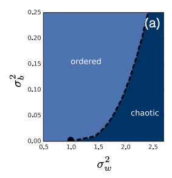

# Deep Learning Theory
- [Deep Learning Theory](#deep-learning-theory)
  - [Mean-Field Theory](#mean-field-theory)
    - [Edge of Chaos](#edge-of-chaos)
    - [Dynamical Isometry](#dynamical-isometry)
    - [Case of ResNet](#case-of-resnet)
    - [Case of CNN](#case-of-cnn)
    - [Case of RNN and LSTM](#case-of-rnn-and-lstm)
    - [Case of Batch Normalization](#case-of-batch-normalization)
    - [Dynamical isometry in ResNet](#dynamical-isometry-in-resnet)
  - [Neural Tangent Kernel](#neural-tangent-kernel)
    - [Mean Field Theory of NTK](#mean-field-theory-of-ntk)
    - [Catapult mechanism](#catapult-mechanism)
    - [Initializaion of NTK](#initializaion-of-ntk)
  - [Implicit Bias](#implicit-bias)

## Mean-Field Theory
| Title | Author | Conference | Date |
| :---- | :----- | :--------- | :--- |
| [Exponential expressivity in deep neural networks through transient chaos](https://arxiv.org/abs/2006.06467) | M. Arjovsky et al. | ICML 2020 | 2020-06-12 |
| [Deep infomation propagation](https://arxiv.org/abs/1611.01232) | S. Lin et al. | ICML 2017 | 2016-11-03 |

Mean-field theory is a branch of mathematical physics that studies the behavior of large and complex stochastic systems. It is a powerful tool to analyze the behavior of neural networks.

Through the initialization of the neural network, researchers find that there are two factors that affect the performance of the neural network: **signal forward propagation** and **gradient backward propagation**.

### Edge of Chaos
The mean-field theory has two assumptions:
1. The weight and bias obey the Gaussian distribution with mean 0 and variance $\sigma^2$. $W_{ij} \sim \mathcal{N}(0,\frac{\sigma_w^2}{N})$, $b_i \sim \mathcal{N}(0,\sigma_b^2)$. where $N$ is the depth of the neural network.
2. The width of the neural network is infinite.

**Expressivity**: The expressivity is the correlation between the different input features in corresponding hidden layer. It is equivalent to the inner product.
$$z_i^l=\sum_{j=1}^{N_{l-1}} W_{ij}^l y_j^l+b_i^l$$
$$y_i^{l+1}=\phi(z_i^l)$$
where $z_i^l$ is the input of the $i$-th neuron in the $l$-th layer, $y_j^l$ is the output of the $j$-th neuron in the $l$-th layer.
The correlation between the input features is:
$$\mathbb{E}[z^l_{i;a}z^l_{i;b}]=q_{ab}^l$$
Where the $a,b$ is the index of input vector.

We set the parameter plain with variance of the weight and bias. We observe that two phase **ordered phase** and **chaotic phase**.

From the perspective of **signal forward propagation**, the correlation of two input features in ordered phase will end up with $1$, and in chaotic phase will end up with a number smaller than $1$, the information lost at a **exponential** speed. 
If the parameter is in the **critical line (edge of chaos)**, the neural network can work in deeper layers, the information lost at a **polynomial** speed.

From the perspective of **gradient backward propagation**, the neural network has a good **trainablity** in critical line. The gradient will not vanish or explode. While in ordered phase, the gradient will vanish. In chaotic phase, the gradient will explode.

The reason is that for ordered phase and chaotic phase, the correlation will end up with a **fixed-point**. It is only related to the structure of network and parameters. The information will be lost in the forward propagation.

### Dynamical Isometry
**Dynamical Isometry** is a property of the neural network, which means that the **singular value** of the Input-Output Jacobian matrix of the neural network is $1$ or nearby. It is a sufficient condition for the neural network to work well. The matrix is:
$$J_{ij}=\frac{\partial y_i}{\partial x_j}$$
where $y_i$ is the output of the $i$-th neuron, $x_j$ is the input of the $j$-th neuron.

**Random Matrix Theory** is used to compute the Singular Value Distribution of the Jacobian matrix.
Through the computation, we find the Jacobian Singular Value Distribution is a **semicircle distribution**. The mean of the distribution is $1$ and the variance is $\frac{1}{N}$.

Hard tanh orthogonal initialization can be closer to the dynamical isometry condition.

where dashes line corresponds to the Gaussian Initialization, real line corresponds to the Orthogonal initialization. Blue corresponds $\tanh \sigma_w^2=1.05$, red is $\tanh \sigma_w^2= 2$, black is ReLU $\sigma_w^2=2 $

### Case of ResNet
| Title | Author | Conference | Date |
| :---- | :----- | :--------- | :--- |
| [Mean field residual networks: On the edge of chaos](https://arxiv.org/abs/1712.08969) | M. Arjovsky et al. | ICML 2018 | 2017-12-22 |
ResNet is always in the critical line.

Optimal initialization variance of ResNet depends on the depth of the network. The common Xavier or He initialization is not optimal for ResNet.

The lighter color corresponds to the higher accuarcy.

### Case of CNN
| Title | Author | Conference | Date |
| :---- | :----- | :--------- | :--- |
| [Dynamical isometry and a mean field theory of CNNs: How to train 10,000-layer vanilla convolutional neural networks](https://arxiv.org/abs/1806.05393) | L. Xiao et al. | ICML 2018 | 2018-06-14 |

The differences of CNN and other fully-connected neural networks are:
1. The channels of CNN is infinite.
2. CNN is 2-dimention integral.
3. CNN exists depth-scale to control the different frequence of signal.

Some Conclusions:
1. Orthogonal initialization performs better then Gaussian in CNN.
2. We can even train a CNN with 10000 layers with the optimal initialization.

### Case of RNN and LSTM
| Title | Author | Conference | Date |
| :---- | :----- | :--------- | :--- |
| [Dynamical isometry and a mean field theory of RNNs: Gating enables signal propagation in recurrent neural networks](https://arxiv.org/abs/1806.05394) | L. Xiao et al. | ICML 2018 | 2018-06-14 |
vanilla RNN is difficult to train, but LSTM and GRU, which is based on gating technology, performs better than vanilla RNN.
The vanilla RNN is:
$$h_t=\tanh(W_{hh}h_{t-1}+W_{xh}x_t+b)$$
while minimal RNN is:
$$e_t=\tanh(W_{hh}h_{t-1}+W_{xh}x_t+b)$$
$$h_t=\sigma(e^t)$$
$$h^t=u^t\odot h^{t-1}+(1-u^t)\odot \tilde{x}^t$$

Vanilla RNN does not have the critical line, because of the input noise destory the ordered phase.

While the minimal RNN is possible due to the gating, it can achieve the dynamical isometry condition through the random matrix theory.

### Case of Batch Normalization
| Title | Author | Conference | Date |
| :---- | :----- | :--------- | :--- |
| [A Mean Field Theory of Batch Normalization](https://arxiv.org/abs/1805.11604) | L. Xiao et al. | ICML 2018 | 2018-05-29 |
There is a phenomenon that gradient explosion appears in the BN network.

### Dynamical isometry in ResNet
| Title | Author | Conference | Date |
| :---- | :----- | :--------- | :--- |
|[Dynamical Isometry is Achieved in Residual Networks in a Universal Way for any Activation Function](https://arxiv.org/abs/1809.08848)| Tarnowski et al. | NeurIPS 2018 | 2018-09-23 |
The input-output Jacobian of ResNet is:
$$\frac{\partial x^L}{\partial x^0}=\prod^L_{l=1}(D^lW^l+I)$$
where $D^l$ is the diagonal matrix of the activation function. $D^l_{ij}=\phi'(h_i^l)\delta_{ij}$
Accroding to the derivation, the distribution of singular value is only related to the activation function with a hyperparameter $c$.
$$G(z)=(zG(z)-1)e^{c(1-2zG(z))}$$
$$c=\frac{1}{L}\sum_{l=1}^Lc_2^l \qquad c_2^l=\frac{\sigma_w^2}{N}\sum_i^N(\phi'(h^l_i))^2$$

## Neural Tangent Kernel
| Title | Author | Conference | Date |
| :---- | :----- | :--------- | :--- |
| [Neural tangent kernel: Convergence and generalization in neural networks](https://arxiv.org/abs/1806.07572) | J. Jacot et al. | NeurIPS 2018 | 2018-06-19 |
| [Wide Neural Networks of Any Depth Evolve as Linear Models Under Gradient Descent](https://arxiv.org/abs/1902.06720) | A. S. Jacot et al. | NeurIPS 2018 | 2019-02-18 |
| [Dynamics of Deep Neural Networks and Neural Tangent Hierarchy](https://arxiv.org/abs/1909.08156) | J. Huang et al. | NeurIPS 2019 | 2019-09-18 |

**Background**: **double descent** curve shows that there is a threshold of model complexity, which indicates that after going over the "U" curve, the over-parameterized model's generalization error will decrease again. This is a phenomenon that is not explained by the traditional bias-variance trade-off theory.

**Suspects:** SGD and its varients implicitly constrain the complexity of the model in a way. Larger model performs well in practice, but how about infinite width model?

The NTK function is:
$$ K_{NTK}(x,x') = \lim_{n\to\infty} \frac{1}{n} \sum_{i=1}^n f(\theta,x) \cdot f(\theta,x')=E_{\theta} [f(\theta,x) \cdot f(\theta,x')]$$
where $f(\theta,x)$ is the output of the neural network with parameter $\theta$ and input $x$. $\theta\sim  \mathcal{N}(0,\sigma^2 I)$.

**Theorem 1**: For a 2-layer neural network with ReLU activation, the NTK converges to a deterministic kernel $K_{\infty}(x,x')$ as $n\to\infty$.

In infinite width limit, the NTK is a deterministic kernel, which means that the neural network is equivalent to a **kernel method**.

**Theorem 2**: In the training process, the NTK is a **fixed** kernel, which means that the NTK is not affected by the time.

**Theorem 3**: The infinite width neural network is equivalent to a **linear model** with feature map $\phi(x)$, where $\phi(x)$ is the **neural tangent feature**.

### Mean Field Theory of NTK
| Title | Author | Conference | Date |
| :---- | :----- | :--------- | :--- |
| [Disentangling neural networks from the neural tangent kernel](https://arxiv.org/abs/1912.13053) | L. Xiao et al. | 
We compute the eigenvalue of NTK in different phases (ordered, chaotic, critical), and do prediction.
1. compute the maximum and minimum eigenvalue and condition number in large-depth network.
2. introduce the residual predictor to measure the generalization error.

### Catapult mechanism
| Title | Author | Conference | Date |
| :---- | :----- | :--------- | :--- |
| [The large learning rate phase of deep learning: the catapult mechanism](https://arxiv.org/abs/2003.02218) | A. Lewkowycz et al. |

**Learning rate interval**: The condition of the loss function converges to global minimum by gradient descent is learning rate is smaller than a certain number. In general the number is $2/\lambda_{max}$, where $\lambda_{max}$ is the maximum eigenvalue of the NTK matrix.
$$f_{t+1}=(1-\eta\lambda_t+\frac{\eta^2f_t^2}{n})f_t$$
$$\lambda_{t+1}=\lambda_t+\frac{\eta f_t^2}{n}(\eta\lambda_t-4)$$

**Lazy phase**: $\eta<\frac{2}{\lambda_0}$, where $\lambda_0$ is the minimum eigenvalue of the NTK matrix. In this phase, the output converges to $0$ at a speed of exponential. The $\lambda_0$ will not change.

**Catapult phase**: $\frac{2}{\lambda_0}<\eta<\frac{4}{\lambda_0}$ the output will increase first and then decrease to $0$. The $\lambda_t$ decreases slowly because of the the network is wide enough.

**Divergence phase**: both of them will increase and diverge.

The conclusion is that in the catapult phase, the generalization performs well.

### Initializaion of NTK
| Title | Author | Conference | Date |
| :---- | :----- | :--------- | :--- |
| [Width Provably Matters in Optimization for Deep Linear Neural Networks](https://arxiv.org/abs/1901.08572)|
| [Provable Benefit of Orthogonal Initialization in Optimizing Deep Linear Networks](https://arxiv.org/abs/2001.05992)

We compare the **Gaussian** initializaion and **Orthogonal** initializaion. Gaussian initializaion has the requirement of width of the network, while orthogonal initializaion does not. The orthogonal initializaion is better than Gaussian initializaion in the optimization process.

## Implicit Bias
| Title | Author | Conference | Date |
| :---- | :----- | :--------- | :--- |
| [The Implicit Bias of Gradient Descent on Separable Data](https://arxiv.org/abs/1710.10345)|  

**Background**: **Over-parameterized** model can fit the training dataset at nearly zero error and generalizes well in test dataset. It is contradictory to the traditional bias-variance trade-off theory. We call the assumption **Implicit Bias** and phenomenon **Benign Overfitting**.

2 assumption:
1. The training dataset is linear separable.
2. loss funtion is differentiable and monotonically decreasing.

One-layer linear neural network will end up with an SVM maximum margin. Norm of weight will go to infinity.

Deep linear neural network, the $\prod W_i$ as a whole will perform consistently with the one-layer linear neural network. For each layer, weight matrix will tend to be a rand-1 matrix. The neibor weight matrices have alignment.
