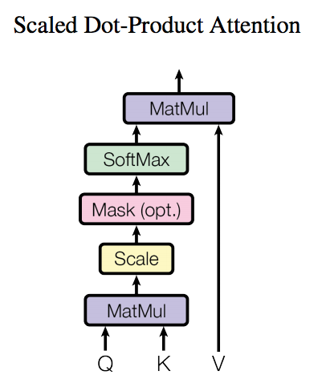

# Natural Language Processing
before beginning NLP course, we should study the machine learning.

- [Natural Language Processing](#natural-language-processing)
  - [1. Word Vectors](#1-word-vectors)
    - [1.1. Distributional semantics](#11-distributional-semantics)
    - [1.2. Word2Vec](#12-word2vec)
    - [1.3. Skip-gram model](#13-skip-gram-model)
    - [1.4. CBOW model (Continuous Bag-of-Words)](#14-cbow-model-continuous-bag-of-words)
    - [1.5. Negative sampling](#15-negative-sampling)
    - [1.6. Hierarchical softmax](#16-hierarchical-softmax)
    - [1.7. The skip-gram model with nagative sampling](#17-the-skip-gram-model-with-nagative-sampling)
  - [2. GloVe (Global Vectors for Word Representation)](#2-glove-global-vectors-for-word-representation)
    - [2.1. Co-occurrence matrix](#21-co-occurrence-matrix)
    - [2.2. GloVe model](#22-glove-model)
    - [2.3. Evaluate word vectors](#23-evaluate-word-vectors)
    - [2.4. Word Sense](#24-word-sense)
  - [3. Dependency parsing and Syntactic Structure](#3-dependency-parsing-and-syntactic-structure)
    - [3.1. Constituency Parsing](#31-constituency-parsing)
    - [3.2. Dependency Parsing](#32-dependency-parsing)
  - [4. Language model and RNN(Recurrent Neural Network)](#4-language-model-and-rnnrecurrent-neural-network)
    - [4.1. N-gram Language Models](#41-n-gram-language-models)
    - [4.2. Recurrent Neural Networks Language Models](#42-recurrent-neural-networks-language-models)
    - [4.3. Vanishing and Exploding Gradients](#43-vanishing-and-exploding-gradients)
    - [4.4. Long Short-Term Memory (LSTM)](#44-long-short-term-memory-lstm)
    - [4.5. Gated Recurrent Unit (GRU)](#45-gated-recurrent-unit-gru)
  - [5. Sequence-to-Sequence Models](#5-sequence-to-sequence-models)
  - [6. Attention Mechanism](#6-attention-mechanism)
  - [7. Transformer](#7-transformer)
    - [7.1. Self-Attention](#71-self-attention)
    - [7.2. Multi-head Attention](#72-multi-head-attention)
    - [7.3. Positional Encoding](#73-positional-encoding)
    - [7.4. Add \& Norm](#74-add--norm)
    - [7.5. Output Embedding](#75-output-embedding)

## 1. Word Vectors
| Title | Author | Conference | Date | Model |
| :---: | :---: | :---: | :---: | :---: |
| [Efficient Estimation of Word Representations in Vector Space](https://arxiv.org/pdf/1301.3781.pdf) | Tomas Mikolov, Kai Chen, Greg Corrado, Jeffrey Dean | ICLR |2013 | Word2Vec | 
| [Distributed Representations of Words and Phrases and their Compositionality](https://arxiv.org/pdf/1310.4546.pdf) | Tomas Mikolov, Ilya Sutskever, Kai Chen, Greg Corrado, Jeffrey Dean | NIPS |2013 | Word2Vec | 
| [word2vec parameter learning explained](https://arxiv.org/pdf/1411.2738.pdf) | Xin Rong | arXiv |2014 | Word2Vec |

materiers:
- [Word2Vec Tutorial - The Skip-Gram Model](http://mccormickml.com/2016/04/19/word2vec-tutorial-the-skip-gram-model/)
- [Zhihu](https://zhuanlan.zhihu.com/p/53425736)

How do we represent the meaning of a word?
Previously commonest NLP solution is using a thesaurus containing lists of **synonym** sets and **hypernyms** (is-a relationships) called **WordNet**. But it is not enough to represent the meaning of a word.
```python
from nltk.corpus import wordnet as wn
poses = {'n': 'noun', 'v': 'verb', 's': 'adj (s)', 'a': 'adj', 'r': 'adv'}
for synset in wn.synsets("good"):
    print("{}: {}".format(poses[synset.pos()],
                          ", ".join([l.name() for l in synset.lemmas()])))
```
The output is:
```
noun: good
noun: good, goodness
noun: good, goodness
noun: commodity, trade_good, good
adj (s): full, good
adj (s): good
adj (s): estimable, good, honorable, respectable
adj (s): beneficial, good
adj (s): good
adj (s): good, just, upright
...
adverb: well, good
adverb: thoroughly, soundly, good
```
```python
from nltk.corpus import wordnet as wn
panda = wn.synset('panda.n.01')
hyper = lambda s: s.hypernyms()
list(panda.closure(hyper))
```
The output is:
```
[Synset('procyonid.n.01'),
 Synset('carnivore.n.01'),
 Synset('placental.n.01'),
 Synset('mammal.n.01'),
 Synset('vertebrate.n.01'),
 Synset('chordate.n.01'),
 Synset('animal.n.01'),
 Synset('organism.n.01'),
 Synset('living_thing.n.01'),
 Synset('whole.n.02'),
 Synset('object.n.01'),
 Synset('physical_entity.n.01'),
 Synset('entity.n.01')]
```

Problems with resources like WordNet:
- missing nuance
- missing new meanings(impossiable to up-to-date)
- requires human labor to create and adapt

In traditional NLP, we regard words as discrete symbols, such symbols for words are represented by **one-hot** vectors:
- each word in the vocabulary is represented by a vector with 1.0 in the position corresponding to the word's index in the vocabulary and 0s in all other positions.
- the number of dimensions of these vectors is the size of the vocabulary.
for example, $v_{cat} = [0, 1, 0, 0, 0, 0, 0, 0, 0, 0]$ and $v_{dog} = [0, 0, 0, 0, 0, 0, 0, 0, 0, 1]$.

The problems of one-hot vectors are:
- they are high-dimensional
- they are sparse (most of the elements are zero)
- The two vectors are orthogonal
- There is no natural notion of similarity for one-hot vectors.

**Learn to encode similarity in the vectors themselves**

### 1.1. Distributional semantics
**Distributional semantics:** A word's meaning is given by the words that frequently appear close-by. It is one of the most successful ideas of modern statistical NLP.
When a word *w* appears in a text, its context is the set of words that appear nearby(within a fixed-size window).
We use the many contexts of *w* to build up a representation of *w*.
The **context words** will represent a *word*
```python
import nltk
from nltk.tokenize import word_tokenize
from collections import Counter
text = "Hello, this is a test sentence."
tokens = word_tokenize(text.lower())
print(tokens)
```
The output is:
```
['hello', ',', 'this', 'is', 'a', 'test', 'sentence', '.']
```

### 1.2. Word2Vec
We will build a dense vector for each word, chosen so that it is similar to vectors of words that appear in similar contexts, measuring similarity as the vector **dot product**.
**Word vectors** are also called **word embeddings** or **neural word representations**.
for example:
$$\text{banking}= \begin{bmatrix} 0.286 & 0.792 & -0.177 & \cdots & -0.107 & 0.731 & 0.197 & \cdots & -0.532 & 0.419 \end{bmatrix}$$

**Word2Vec** is a framework for learning word vectors.
Idea: 
- We have a large corpus of text
- Every word in a fixed vocabulary is represented by a vector
- Go through each position t in the text, which has a center word *c* and context ("outside") words *o*
- Use the **similarity of the word vectors** for *c* and *o* to **calculate the probability** of *o* given *c* (or vice versa)
- **Keep adjusting the word vectors** to maximize this probability


A cool example: $\text{man}-\text{woman}= \text{king}-\text{queen}$

**It's important that the input vector and output vector are just different representations of the same word. Because we predict the word in terms of context words.**


### 1.3. Skip-gram model
For each position $t = 1, \cdots, T$, predict context words within a window of fixed size $m$ given center word $w_t$. The likelihood is given by:
$$L(\theta) = \prod_{t=1}^T \prod_{-m \leq j \leq m, j \neq 0} P(w_{t+j} | w_t; \theta)$$
where $\theta$ is the parameter of the model, which are the word vectors for all words in the vocabulary and the neural network weights, the $m$ is the size of the context window.
The objective function is the average log probability:
$$J(\theta) = -\frac{1}{T} \log L(\theta) = -\frac{1}{T} \sum_{t=1}^T \sum_{-m \leq j \leq m, j \neq 0} \log P(w_{t+j} | w_t; \theta)$$
The conditional probability is defined as:
$$P(o | c) = \frac{\exp(\text{score}(o, c))}{\sum_{w \in V} \exp(\text{score}(w, c))}$$
where $V$ is the vocabulary and the score function is defined as:
$$\text{score}(o, c) = u_o^T v_c$$
where $u_o$ is the "outside" vector for $o$ and $v_c$ is the "center" vector for $c$.

To train the model: optimize value of parameters to minimize loss by SGD.
$$\theta^* = \arg \min_\theta J(\theta)$$
where $\theta$ is the parameter of the model, which are the word vectors for all words in the vocabulary and the neural network weights.

$v$ represents the center word vector, $u$ represents the outside word vector.

### 1.4. CBOW model (Continuous Bag-of-Words)
The CBOW model is very similar to the skip-gram model. The only difference is that CBOW predicts the current word based on the context, whereas the skip-gram predicts surrounding words given the current word.

The model makes the same predictions at each position. We want a model that gives a reasonably high probability estimate to all words that occur in the context.
### 1.5. Negative sampling
The problem with the softmax function is that it is **computationally expensive** to calculate the denominator of the softmax function, which involves summing over all words in the vocabulary.

The idea of negative sampling is to only update the parameters for the target word and a small number of other "negative" words, rather than updating all the parameters for each training sample.

Train binary logistic regressions to differentiate a true pair of $(c, o)$ from a noise pair of $(c, o')$.

### 1.6. Hierarchical softmax
Hierarchical softmax is an alternative to the softmax function that is more efficient to compute. It is based on the idea of a binary tree, where each leaf node represents a word in the vocabulary.

### 1.7. The skip-gram model with nagative sampling
The objective function is:
$$J(\theta) = -\frac{1}{T} \sum_{t=1}^T \left[ \log \sigma(u_{w_t}^T v_{w_t}) + \sum_{i=1}^k \mathbb{E}_{w_i \sim P_n(w)} \log \sigma(-u_{w_i}^T v_{w_t}) \right]$$
where $k$ is the number of negative samples, $P_n(w)$ is the noise distribution, which is usually chosen to be the unigram distribution raised to the 3/4 power.

## 2. GloVe (Global Vectors for Word Representation)
| Title | Author | Conference | Date | Model |
| :---: | :---: | :---: | :---: | :---: |
|[GloVe: Global Vectors for Word Representation](https://nlp.stanford.edu/pubs/glove.pdf) | Jeffrey Pennington, Richard Socher, Christopher D. Manning | EMNLP | 2014 | GloVe |
| [Improving Distributional Similarity with Lessons Learned from Word Embeddings](https://www.aclweb.org/anthology/Q15-1016.pdf) | Omer Levy, Yoav Goldberg, Ido Dagan | TACL | 2015 | GloVe |
| [Evaluation methods for unsupervised word embeddings](https://www.aclweb.org/anthology/D15-1036.pdf) | Tobias Schnabel, Igor Labutov, David Mimno, Thorsten Joachims | EMNLP | 2015 | GloVe |
| [A Latent Variable Model Approach to PMI-based Word Embeddings](https://www.aclweb.org/anthology/P15-1078.pdf) | Omer Levy, Yoav Goldberg | TACL | 2015 | GloVe |
| [Linear Algebraic Structure of Word Senses, with Applications to Polysemy](https://www.aclweb.org/anthology/P15-2071.pdf) | Omer Levy, Yoav Goldberg, Ido Dagan | TACL | 2015 | GloVe |
| [On the Dimensionality of Word Embedding](https://www.aclweb.org/anthology/P15-2078.pdf) | Omer Levy, Yoav Goldberg | TACL | 2015 | GloVe |
### 2.1. Co-occurrence matrix
The co-occurrence matrix $X$ is a $|V| \times |V|$ matrix, where $V$ is the vocabulary. The $(i, j)$-th element of $X$ is the number of times word $i$ occurs in the context of word $j$.
We just accumulate all the statistics of what appear near each other.

**Co-occurrence vectors** are the rows of the co-occurrence matrix. They are the vectors that represent each word. It has some disadvantages:
- The matrix is very large and requires a lot of storage.
- The matrix is very sparse and is less robust.

What we need is **Low-dimensional dense vectors**.
idea: store most of the important information in a fixed, small number of dimensions. We need to reduce the dimensionality.

**SVD(singular value decomposition)** is a good way to reduce the dimensionality of the co-occurrence matrix. The co-occurrence matrix $X$ can be decomposed into three matrices $U$, $\Sigma$, $V^T$:
$$X = U \Sigma V^T$$
where $U$ is a $|V| \times k$ matrix, $\Sigma$ is a $k \times k$ matrix, $V^T$ is a $k \times |V|$ matrix, $k$ is the number of dimensions we want to reduce to.

Running an SVD on raw counts doesn't work well. We need to do some preprocessing:
- Remove very frequent words (the, of, and, etc.)
- Scale the remaining counts using PPMI (positive pointwise mutual information)
We also can use Pearson correlations instead of counts. then set the negative values to zero.

**Count based** vs. **direct prediction**:
- Count based: LSA, HAL, Hellinger PCA. Fast
  - advantages: fast, efficient use of statistics.
  - disadvantages: primarily capture word similarity, disproportionate importance given to large counts.
- Direct prediction: word2vec, GloVe. NNLM, RNN
  - advantages: generate improved performance on other tasks, can capture complex patterns beyond word similarity.
  - disadvantages: scale with corpus size, less efficient use of statistics.

### 2.2. GloVe model
The idea of GloVe is to learn word vectors such that their dot product equals the logarithm of the words' probability of co-occurrence.
$$w_i^T w_j = \log X_{ij}$$
where $w_i$ is the vector for word $i$ and $X_{ij}$ is the number of times word $j$ occurs in the context of word $i$.
with vector differences:
$$(w_i - w_j)^T w_k = \log \frac{X_{ik}}{X_{jk}}$$
The objective function is:
$$J = \sum_{i, j=1}^{|V|} f(X_{ij}) (w_i^T \tilde{w}_j + b_i + \tilde{b}_j - \log X_{ij})^2$$
where $f$ is a weighting function, $b_i$ and $\tilde{b}_j$ are bias terms.
The advantage of GloVe is that it is scalable and can learn from large corpora.


### 2.3. Evaluate word vectors
general evaluation in NLP: intrinsic and extrinsic.
- Intrinsic evaluation: evaluate the word vectors on a specific task.
  - fast to compute, but not clear if really helpful unless correlation to real task is established.

Word vector analogies:
- $a$ is to $b$ as $c$ is to $d$.

$$\arg \max_{d \in V} \cos(d, b - a + c)$$
$$ d= \arg \max_{x \in V} \frac{x^T (b - a + c)}{ ||b - a + c||}$$

- Extrinsic evaluation: evaluate the word vectors on a downstream task.
  - take a long time to compute accuracy, and unclear if the subsystem with another improves accuracy.

**named entity recognition:** identifying references to a person, organization or location: Chris Manning lives in Palo Alto.

### 2.4. Word Sense
Most words have lots of meanings. We need to disambiguate the meaning of a word in a particular context. Especially common words.
What we want to do is to choose the correct meaning of a word in a particular context.

One idea is that clusting word windows around words, retrain with each word assigned to multiple different clusters $\text{bank}_1$, $\text{bank}_2$, $\text{bank}_3$, $\text{bank}_4$, etc.

**Linear algebraic structure of word senses:**
Different senses of a word reside in a linear superposition (weighted sum) in standard word embeddings like word2vec and GloVe.
$$\text{bank} = \alpha_1\text{bank}_1 + \alpha_2\text{bank}_2 + \alpha_3 \text{bank}_3 + \alpha_4\text{bank}_4$$

Because of ideas from sparse coding you can actually separate out the senses.


## 3. Dependency parsing and Syntactic Structure
|Title|Author|Conference|Year|Model|
|-|-|-|-|-|
|[A Fast and Accurate Dependency Parser using Neural Networks](https://www.aclweb.org/anthology/D14-1082.pdf)|Danqi Chen, Christopher D. Manning|EMNLP|2014|Neural Network|


Phrase structure = Context-Free Grammars (**CFGs**) 

Phrase structure organize words into nested **constituents**. Constituents are phrases that behave as a unit. Constituents are often noun phrases, verb phrases, prepositional phrases, etc.
for example:
| | | | | |
|-|-|-|-|-|
| |the| |cat| |
| |a  | |dog| |
| |   |large|     |in a crate
| |   |barking|   |on the table
| |   |cuddly|    |by the door
|talk to| 
|walked behind

### 3.1. Constituency Parsing
**Constituency parsing** is the task of recovering the constituency structure of a sentence. It is also called **phrase-structure parsing**.

**Part of speech(POS)** tagging is a prerequisite for constituency parsing. We need to know the part of speech of each word in order to parse the sentence.

For example, when we analyze the sentence "the cuddly cat by the door", 'the' is a determiner, 'cuddly' is an adjective, 'cat' is a noun, 'by' is a preposition, 'the' is a determiner, and 'door' is a noun.

And then, 'the cuddly cat' is a noun phrase(NP), 'by the door' is a prepositional phrase(PP), and 'the cuddly cat by the door' is a noun phrase(NP).

### 3.2. Dependency Parsing
**Dependency Structure** is a tree that connects words according to their syntactic dependency relationship. The root of the tree is the main verb of the sentence. The tree is directed and acyclic.


where nsubj is the nominal subject, aux is the auxiliary, nmod is the nominal modifier, obl is the oblique nominal.

Because of many kinds of ambiguity, we need to use **Dependency Parsing**.
What sources of information can we use dependency parsing?
- Bilexical affinities: the words that are close to each other are more likely to be related.
- Valency: the number of arguments a word takes.
- Intervening material: Dependencies rarely span intervening verbs or punctuation.
- Dependency distance: Most dependencies are between nearby words.

A sentence is parsed by choosing for each word what other word it is a dependent of. 
Usually some constraints:
- There is only one root.
- There are no cycles.

This makes the dependencies a tree

How to build a dependency tree: **Transition-based Dependency Parsing**. It can be considered as a finite state machine. For any $S=w_1 w_2 \cdots w_n$, we have a **stack** $s$, a **buffer** $b$, and a set of **dependencies** $A$ where the element is$(w_i, r, w_j)$, which means $w_i$ is the head of $w_j$ with relation $r$.


The algorithm is:
- Shift: move the first word in the buffer to the top of the stack.
- Left-Arc: add a dependency $(w_i, r, w_j)$ to $A$, where $w_i$ is the top of the stack and $w_j$ is the second word in the stack.
- Right-Arc: add a dependency $(w_j, r, w_i)$ to $A$, where $w_i$ is the top of the stack and $w_j$ is the second word in the stack.
  
Until the buffer is empty and the stack has only one element, which is the root. For each state, we can consider it as a multi-classification task(2R class for left and right) and apply softmax or SVM to choose the **next action**.

For evalutaion, we have two metrics:
-  **labeled attachment score(LAS)**, which is the percentage of words that have the correct head and the correct relation.
-  **unlabeled attachment score(UAS)**, which is the percentage of words that have the correct head.

**Neural Dependency Parsing** is used to improve the performance of dependency parsing. The idea is to use a neural network to predict the next action. The input is the current state, and the output is the next action.

The input is stack, buffer, the set of dependencies, POS tag, arc label. 


More advanced: **Graph-based Dependency Parsing**. It computes a score for every possible dependency for each word. The score is a combination of features of the two words and the relation between them. The score is computed by a neural network.


## 4. Language model and RNN(Recurrent Neural Network)
|Title|Author|Conference|Year|Model|
|-|-|-|-|-|
|[A Neural Probabilistic Language Model](http://www.jmlr.org/papers/volume3/bengio03a/bengio03a.pdf)|Yoshua Bengio, Réjean Ducharme, Pascal Vincent, Christian Jauvin|JMLR|2003|Neural Network|
|[Recurrent Neural Network Regularization](https://arxiv.org/pdf/1409.2329.pdf)|Wojciech Zaremba, Ilya Sutskever, Oriol Vinyals|ICLR|2015|Neural Network|
**Language model** is the task of predicting what word comes next

More formally: given a sequence of words $w_1, w_2, \cdots, w_n$, we want to compute the probability of the sequence $P(x^{(t+1)}|x^{(1)}, \cdots, x^{(t)}$, where $x^{(t+1)}$ can be any word in the vocabulary $V = \{w_1, \cdots, w_V\}$. 

We can also think of a language model as a system that assigns a probability to a piece of text.

According to the chain rule of probability, we have:
$$P(x^{(1)}, \cdots, x^{(t)}) = \prod_{i=1}^t P(x^{(i)}|x^{(1)}, \cdots, x^{(i-1)})$$

### 4.1. N-gram Language Models
**N-gram** is a sequence of N words. For example, "I am a student" is a 4-gram.

An n-gram is a chunk of *n* consecutive words.
unigrams: I, am, a, student
bigrams: I am, am a, a student
trigrams: I am a, am a student
4-grams: I am a student

Collect statistics about how frequent different n-grams are and use these to predict next word.

**Markov assuption:** the probability of a word only depends on the previous *n-1* words.
$$P(x^{(t+1)}|x^{(1)}, \cdots, x^{(t)}) = P(x^{(t+1)}|x^{(t-n+2)}, \cdots, x^{(t)})$$
By counting them in a large corpus, we can estimate the probability of a word given the previous *n-1* words.
$$P(x^{(t+1)}|x^{(t-n+2)}, \cdots, x^{(t)}) = \frac{C(x^{(t-n+2)}, \cdots, x^{(t+1)})}{C(x^{(t-n+2)}, \cdots, x^{(t)})}$$
where $C(x^{(t-n+2)}, \cdots, x^{(t+1)})$ is the number of times the sequence $x^{(t-n+2)}, \cdots, x^{(t+1)}$ appears in the corpus, and $C(x^{(t-n+2)}, \cdots, x^{(t)})$ is the number of times the sequence $x^{(t-n+2)}, \cdots, x^{(t)}$ appears in the corpus.

**Storage problem** with n-gram language models: the number of parameters grows exponentially with n. For example, if we have a vocabulary of 100,000 words, and we want to use a 5-gram language model, we need to store $100,000^5 = 10^{20}$ parameters.

**Smoothing** is used to solve the problem of unseen n-grams. We can add a small constant to the numerator and denominator of the equation above. For example, we can add 1 to the numerator and add $|V|$ to the denominator.

**Backoff** is used to solve the problem of unseen n-grams. If we have no data for a 5-gram, we can use a 4-gram. If we have no data for a 4-gram, we can use a 3-gram. If we have no data for a 3-gram, we can use a 2-gram. If we have no data for a 2-gram, we can use a 1-gram.

**Interpolation** is used to solve the problem of unseen n-grams. We can use a weighted average of the probabilities of different n-grams. For example, we can use 0.5\*P(5-gram) + 0.3\*P(4-gram) + 0.2\*P(3-gram).

**Sparsity problem:** the number of n-grams that appear in a corpus is much smaller than the number of possible n-grams. For example, if we have a vocabulary of 100,000 words, and we want to use a 5-gram language model, we need to store $100,000^5 = 10^{20}$ parameters, but the number of 5-grams that appear in a corpus is much smaller than $10^{20}$.

The n-gram language model has a problem that in generating text is that the sentence is surprisingly grammatical but semantically meaningless.

### 4.2. Recurrent Neural Networks Language Models
fixed-window neural language model improves the n-gram LM (storage problem and sparsity problem) but still have some problems: The fixed window is too small and there is no way to share parameters between different parts of the sentence.


The core idea of **RNN** is applying the same weights $W$ repeatedly.

The hidden state $h_t$ is a function of the previous hidden state $h_{t-1}$ and the current input $x_t$ and the $W$ is shared across all time steps.

The loss functino is cross entropy of the next word:
$$J(\theta) = -\sum_{t=1}^T \log P(x_t|x_1, \cdots, x_{t-1}; \theta)$$
where $\theta$ is the parameters of the RNN.
The metric is perplexity:
$$PP(x_1, \cdots, x_T) = \sqrt[T]{\frac{1}{P(x_1, \cdots, x_T)}}$$
The higher, the more perplex.

The advantages and disadvantages of RNN:
- Advantages: 
    - The hidden state $h_t$ can capture information from the entire sentence.
    - The number of parameters is independent of the length of the sentence. Model size doesn't increase

- Disadvantages:
  - It needs sequential computation, which is slow.
  - It is hard to capture long-range dependencies. The gradient vanishes or explodes as the number of time steps increases.


### 4.3. Vanishing and Exploding Gradients
RNN has a problem of vanishing and exploding gradients. The gradient of the loss function with respect to the parameters of the RNN is:
$$\frac{\partial J}{\partial W} = \sum_{t=1}^T \frac{\partial J}{\partial h_t} \frac{\partial h_t}{\partial h_{t-1}} \cdots \frac{\partial h_2}{\partial h_1} \frac{\partial h_1}{\partial W}$$
where $\frac{\partial J}{\partial h_t}$ is the gradient of the loss function with respect to the hidden state $h_t$.
If we ignore the activation function, we have:
$$\frac{\partial h_t}{\partial h_{t-1}} = W$$
We can observe that when the $W$ is too small or too large or the distance between $i$ and $j$ is too large, the gradient will vanish or explode.

The **vanishing** problems show that the RNN can't capture long-range dependencies.

The **explosion** problems show that the RNN can't train.
There is a solution to the explosion problem: **gradient clipping**. We can clip the gradient to a maximum value.

### 4.4. Long Short-Term Memory (LSTM)
LSTM is a special type of RNN that can solve the vanishing and exploding gradients problem. It has a memory cell $c_t$ and three gates: input gate $i_t$, forget gate $f_t$, and output gate $o_t$.

The LSTM formula is:
$$c_t = f_t \odot c_{t-1} + i_t \odot \tanh(W_c [h_{t-1}, x_t] + b_c)$$
$$h_t = o_t \odot \tanh(c_t)$$
$$i_t = \sigma(W_i [h_{t-1}, x_t] + b_i)$$
$$f_t = \sigma(W_f [h_{t-1}, x_t] + b_f)$$
$$o_t = \sigma(W_o [h_{t-1}, x_t] + b_o)$$
where $\odot$ is the element-wise multiplication, $\sigma$ is the sigmoid function, $W_c, W_i, W_f, W_o$ are the parameters of the LSTM, and $b_c, b_i, b_f, b_o$ are the biases of the LSTM.


The LSTM architexture makes it easier for the RNN to preserve information over many timesteps.
The gates are vectors of numbers between 0 and 1. The forget gate $f_t$ controls how much of the previous memory cell $c_{t-1}$ is preserved. The input gate $i_t$ controls how much of the new memory cell $\tanh(W_c [h_{t-1}, x_t] + b_c)$ is added to the memory cell $c_{t-1}$. The output gate $o_t$ controls how much of the memory cell $c_t$ is outputted.

### 4.5. Gated Recurrent Unit (GRU)
GRU is a special type of RNN that can solve the vanishing and exploding gradients problem. It has a memory cell $c_t$ and two gates: update gate $z_t$ and reset gate $r_t$.

The GRU formula is:
$$c_t = z_t \odot c_{t-1} + (1 - z_t) \odot \tanh(W_c [r_t \odot h_{t-1}, x_t] + b_c)$$
$$h_t = c_t$$
$$z_t = \sigma(W_z [h_{t-1}, x_t] + b_z)$$
$$r_t = \sigma(W_r [h_{t-1}, x_t] + b_r)$$
where $\odot$ is the element-wise multiplication, $\sigma$ is the sigmoid function, $W_c, W_z, W_r$ are the parameters of the GRU, and $b_c, b_z, b_r$ are the biases of the GRU.

## 5. Sequence-to-Sequence Models
|Title|Author|Conference|Year|Date|
|---|---|---|---|---|
|[Sequence to Sequence Learning with Neural Networks](https://arxiv.org/abs/1409.3215)|Ilya Sutskever, Oriol Vinyals, Quoc V. Le|NIPS|2014|2014-09-10|

Reading materier:
[Jalammar](https://jalammar.github.io/visualizing-neural-machine-translation-mechanics-of-seq2seq-models-with-attention/)

**Neural machine translation** (NMT) is a sequence-to-sequence model. It takes a sequence of words in one language as input and outputs a sequence of words in another language. The neural network architecture is called a sequence-to-sequence model (aka seq2seq) and it involves two **RNNs**. The seq2seq has another famous name: **encoder-decoder**.

NMT is decomposed into **Language model** and **Translation model**. The language model is to learn the structure of objective language grammar. The translation model is to learn the mapping between two languages by paralled corpus.
By Baysian rule, we have:
$$\arg \max_{e} P(e|f) = \arg \max_{e} P(f|e) P(e)$$
where $e$ is the objective language and $f$ is the source language.

There is a latent variable $a$ that represents the **alignment** between the source sentence and the objective sentence. We have:
$$\arg \max_{e} P(e|f) = \arg \max_{e} \sum_a P(f, a|e) P(e)$$
where $a$ is the alignment between the source sentence and the objective sentence.
**Alignment** is the correspondence between particular words in the translated sentence pair. Some words have no counterpart.

**Decoding** is to find the best translation:
$$\hat{e} = \arg \max_{e} P(e|f)$$
where $e$ is the objective language and $f$ is the source language.
We use dynamic programming for globally optimal solutions.


The loss function is: $$J = -\sum_{t=1}^T \log P(e_t|e_1, \cdots, e_{t-1}, f)$$

The decoder of training and testing are different. when training, the decoder takes the ground truth as input which is called **teacher forcing**. When testing, the decoder takes the previous output as input which is called **free running**.

A better method of training is to use **scheduled sampling**. It is a compromise between teacher forcing and free running.

The **Greed decoding** has some problems. It can't handle the **repetition** problem and the **rare word** problem. The **Beam search** can solve these problems.

The core idea of Beam search decoding is: On each step of decoder, keep track of the $k$ most likely partial hypotheses. The $k$ is called the **beam size**. The beam size is a hyperparameter.

The algorithm is as follows:
1. Initialize the beam size $k$.
2. On each step of decoder, we calculate the scores of all probable output corresponding current input, and choose the highest score of output as next input.
3. repeat until the end of sentence.

The score function is as follows:
$$\text{score}(y_1, \cdots, y_{t-1}, y_t) = \sum_{i=1}^t\log P(y_t|y_1, \cdots, y_{i-1},x)$$


The metric of machine translation is **BLEU(Bilingual Evaluation Understudy):**
The idea is to compare the machine translation with the reference translation. The BLEU score is the geometric mean of the $n$-gram precisions. The $n$-gram precision is the number of $n$-grams in the machine translation that appear in the reference translation, divided by the total number of $n$-grams in the machine translation.
$$\text{BLEU} = \text{BP} \exp \left(\sum_{n=1}^N w_n \log p_n \right)$$
where $p_n$ is the precision of $n$-gram, $w_n$ is the weight of $n$-gram, and $\text{BP}$ is the brevity penalty.
$$\text{BP} = \begin{cases} 1 & \text{if } c > r \\ \exp(1 - r/c) & \text{if } c \leq r \end{cases}$$
where $c$ is the length of candidate sentence and $r$ is the length of reference sentence.

## 6. Attention Mechanism
|Title|Author|Conference|Year|Date|
|---|---|---|---|---|
|[Neural Machine Translation by Jointly Learning to Align and Translate](https://arxiv.org/abs/1409.0473)|Dzmitry Bahdanau, Kyunghyun Cho, Yoshua Bengio|ICLR|2015|2015-09-01|
RNN and LSTM perform not well in long-term input, we use **attention** to allow flexible access to memory.
The trouble with seq2seq is that the only information that the decoder receives from the encoder is the last encoder hidden state. It may lead to **catastrophic forgetting**.
We need to give the decoder a vector representation from every encoder time step so that it can make well-informed translations. That's attention.
Attention has some advantages:
1. low parameter complexity
2. parallelizable (while RNN cannot)
3. better performance
4. solves the bottleneck problem
5. helps with the vanishing gradient problem

Attention treats each word's representation as a **query** to access and incorporate the information from a set of values.

The implementations of an attention layer can be broken down into 4 steps.
1. Prepare hidden state in encoder $(h_1 \cdots h_t)$ by RNN.
2. Assuming the current state is $h_t$, we need to calculate the **correlation** between current output decoder state $h_t$ and each input encoder state $h_i$. The score is obtained by a score function (aka alignment function), the score function is commonly dot product between the decoder and encoder hidden states. 
$$e_t= (a(s_{t-1}, h_1), \cdots, a(s_{t-1}, h_T))$$
where $a$ is the score function.
3. Run all the scores through a softmax layer to get a probability distribution over all the encoder hidden states.
$$\alpha_t = \text{softmax}(e_t)$$
4. Calculate the context vector $c_t$ by the weighted sum of encoder hidden states.
$$c_t = \sum_{i=1}^T \alpha_{t,i} h_i$$
where $T$ is the length of input sequence.
5. Concatenate the context vector $c_t$ and the decoder hidden state $s_t$ to get the final output.
$$\tilde{h}_t = \tanh(W_c[c_t; s_t])$$
where $W_c$ is the weight matrix.


Attention variants:
Basic dot-product attention:
$$a(s_{t-1}, h_i) = s_{t-1}^T h_i$$
Multiplicative attention:
$$a(s_{t-1}, h_i) = s_{t-1}^T W_a h_i$$
Additive attention:
$$a(s_{t-1}, h_i) = v_a^T \tanh(W_a [s_{t-1}; h_i])$$
where $W_a$ and $v_a$ are weight matrices.
## 7. Transformer
|Title|Author|Conference|Year|Date|
|---|---|---|---|---|
|[Attention Is All You Need](https://arxiv.org/abs/1706.03762)|Ashish Vaswani, Noam Shazeer, Niki Parmar, Jakob Uszkoreit, Llion Jones, Aidan N. Gomez, Lukasz Kaiser, Illia Polosukhin|NIPS|2017|2017-06-12|


Where, the multi-head attention is a combination of multiple self-attention layers, each head captures different feature in representation space.

The encoder is composed of a stack of 6 identical layers. Each layer has two sub-layers. The first is a **multi-head self-attention mechanism**, and the second is a simple, position-wise **fully connected feed-forward network.**


### 7.1. Self-Attention

The self-attention layer is a function of three inputs: **query** ($Q$), **key** ($K$), **value** ($V$). The output is a weighted sum of the values, where the weight assigned to each value is computed by a compatibility function of the query with the corresponding key.
$$\text{Attention}(Q, K, V) = \text{softmax}(\frac{QK^T}{\sqrt{d_k}})V$$
where $d_k$ is the dimension of $K$.
It means that when we input a sequence, we need to calculate the attention score of current word with all other words in the sequence. At this time, the **current word is the query**, **all the other words are key and value.** The softmax is used to normalize the attention score.

The **feed forward neural network** is a simple two-layer neural network with a ReLU activation in between. It is used to transform the representation of the attention layer.
$$\text{FFN}(x) = \max(0, xW_1 + b_1)W_2 + b_2$$
where $W_1 \in \mathbb{R}^{d_{\text{model}} \times d_{\text{ff}}}$, $W_2 \in \mathbb{R}^{d_{\text{ff}} \times d_{\text{model}}}$, $b_1 \in \mathbb{R}^{d_{\text{ff}}}$, $b_2 \in \mathbb{R}^{d_{\text{model}}}$.
### 7.2. Multi-head Attention


Multi-head attention means we can have different $Q,K,V$ matrices.
$$\text{MultiHead}(Q, K, V) = \text{Concat}(\text{head}_1, \cdots, \text{head}_h)W^O$$
where $\text{head}_i = \text{Attention}(QW_i^Q, KW_i^K, VW_i^V)$, $W_i^Q \in \mathbb{R}^{d_{\text{model}} \times d_k}$, $W_i^K \in \mathbb{R}^{d_{\text{model}} \times d_k}$, $W_i^V \in \mathbb{R}^{d_{\text{model}} \times d_v}$, $W^O \in \mathbb{R}^{hd_v \times d_{\text{model}}}$.


**Masked multi-head attention layer** is used in decoder to prevent the decoder from cheating by looking ahead at the target words when predicting the next word.

**Encoder-Decoder attention layer** is used to allow every position in the decoder to attend over all positions in the input sequence.

### 7.3. Positional Encoding
The original paper proposed to use sine and cosine functions of different frequencies to encode the **position information**. 
$$\text{PE}_{(pos, 2i)} = \sin(pos/10000^{2i/d_{\text{model}}})$$
$$\text{PE}_{(pos, 2i+1)} = \cos(pos/10000^{2i/d_{\text{model}}})$$
where $pos$ is the position and $i$ is the dimension.
Here, the function is not good enough, and the position information is not well encoded. The lost position information is very important for sequence model in NLP.

### 7.4. Add & Norm
Add means **Residual Connection**, it is used to solve the gradient vanishing problem. The core idea is to add the input to the output of the sub-layer. It is a trick to help models train better.

Norm means **Layer Normalization**, it is used to speed up the training process. The core idea is to normalize the output of the sub-layer. It is a trick to help models train faster.

### 7.5. Output Embedding
The input of output embedding is the **previous output of the decoder**. The output embedding is used to predict the next word. The output embedding is the same as the input embedding.