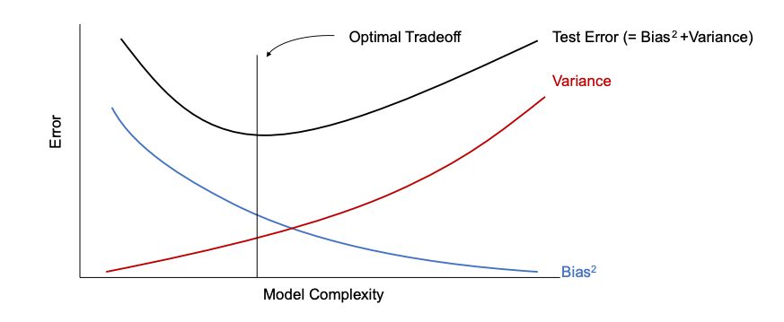
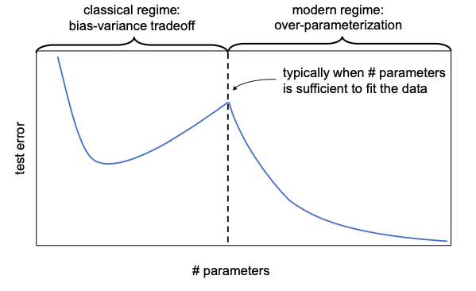
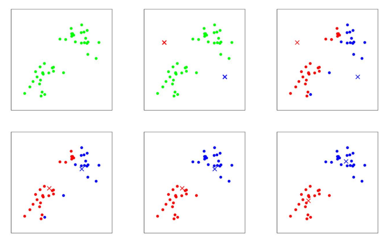
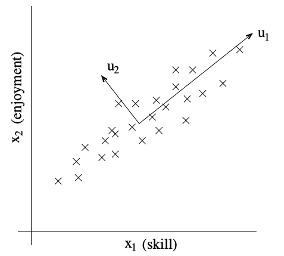
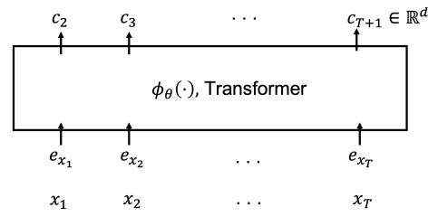

# Machine Learning
This is a repo of my machine learning study.
It includes my learning path, hw and proj of the opencourse, and the conclusive notes of my domain knowledge of ML and DL.

Subfield 
[Natural Language Processing](https://github.com/Yomikoooo/Machine_Learning/tree/main/NLP)
[Deep Learning Theory]()


- [Machine Learning](#machine-learning)
  - [My Learning Process:](#my-learning-process)
    - [Programming:](#programming)
    - [Books:](#books)
    - [Math foundation:](#math-foundation)
    - [OpenCourses:](#opencourses)
    - [Projects in kaggle:](#projects-in-kaggle)
    - [NLP Papers:](#nlp-papers)
- [Notes](#notes)
  - [Online notes](#online-notes)
  - [Reading materials:](#reading-materials)
  - [1. Basics](#1-basics)
    - [Intro:](#intro)
    - [1.1. Data processing:](#11-data-processing)
    - [1.2. Model:](#12-model)
    - [1.3. Loss function](#13-loss-function)
      - [1.3.1. MLE](#131-mle)
      - [1.3.2. MAE](#132-mae)
      - [1.3.3. Cross Entropy](#133-cross-entropy)
    - [1.4. Optimization algorithm:](#14-optimization-algorithm)
      - [1.4.1. Gradient Descent](#141-gradient-descent)
      - [1.4.2. Newton's Method](#142-newtons-method)
    - [1.5. Data Loader](#15-data-loader)
  - [2. Optimization](#2-optimization)
    - [2.1. Gradient Descent](#21-gradient-descent)
  - [3. Linear Regression](#3-linear-regression)
  - [4. Classification](#4-classification)
    - [4.1. Logistic Regression](#41-logistic-regression)
    - [4.2. Perceptron learning aigorithm](#42-perceptron-learning-aigorithm)
  - [5. Generalized Linear Model](#5-generalized-linear-model)
    - [5.1. Exponential Family](#51-exponential-family)
    - [5.2. Generalized Linear Model](#52-generalized-linear-model)
    - [5.3. Softmax Regression](#53-softmax-regression)
  - [6. Generative learning algorithms](#6-generative-learning-algorithms)
    - [6.1. Generative vs. Discriminative](#61-generative-vs-discriminative)
    - [6.2. Gaussian Discriminant Analysis](#62-gaussian-discriminant-analysis)
    - [6.3. Naive Bayes](#63-naive-bayes)
  - [7. Support Vector Machine](#7-support-vector-machine)
    - [7.1. Margin](#71-margin)
    - [7.2. Lagrange Duality](#72-lagrange-duality)
    - [7.3. KKT Conditions](#73-kkt-conditions)
    - [7.4. SVM Optimization steps](#74-svm-optimization-steps)
    - [7.5. Kernel Methods](#75-kernel-methods)
  - [8. Neural Network](#8-neural-network)
    - [8.1. Fully-connected neural network](#81-fully-connected-neural-network)
    - [8.2. Feature engineering](#82-feature-engineering)
    - [8.3. Residual Network (ResNet)](#83-residual-network-resnet)
    - [8.4. Layer Normalization (LN)](#84-layer-normalization-ln)
    - [8.5. Batch Normalization (BN)](#85-batch-normalization-bn)
    - [8.6. Convolutional Layers](#86-convolutional-layers)
    - [8.7. Backpropagation](#87-backpropagation)
  - [9. Generalization](#9-generalization)
    - [9.1. Overfitting and underfitting](#91-overfitting-and-underfitting)
    - [9.2. Double descent phenomenon](#92-double-descent-phenomenon)
    - [9.3. Sample complexity bounds](#93-sample-complexity-bounds)
  - [10. Regularization and model selection](#10-regularization-and-model-selection)
    - [10.1. L1 and L2 regularization](#101-l1-and-l2-regularization)
    - [10.2. Implicit regularization](#102-implicit-regularization)
    - [10.3. Cross-validation](#103-cross-validation)
    - [10.4. Dropout](#104-dropout)
    - [10.5. Parameter Initialization](#105-parameter-initialization)
  - [11. Clustering and the K-means algorithm](#11-clustering-and-the-k-means-algorithm)
  - [12. EM algorithms](#12-em-algorithms)
    - [12.1. Gaussian mixture models](#121-gaussian-mixture-models)
    - [12.2. Jensen's inequality](#122-jensens-inequality)
    - [12.3. Proof of EM algorithm](#123-proof-of-em-algorithm)
    - [12.4. Variational inference and variational auto-encoder(VAE)](#124-variational-inference-and-variational-auto-encodervae)
    - [12.5. Factor analysis](#125-factor-analysis)
  - [13. Principal components analysis(PCA)](#13-principal-components-analysispca)
    - [13.1. PCA algorithm](#131-pca-algorithm)
    - [13.2. Singular value decomposition(SVD)](#132-singular-value-decompositionsvd)
    - [13.3. PCA and LDA](#133-pca-and-lda)
  - [14. Independent component analysis(ICA)](#14-independent-component-analysisica)
    - [14.1. ICA ambiguity](#141-ica-ambiguity)
    - [14.2. ICA algorithm](#142-ica-algorithm)
  - [15. Evaluation Metrics](#15-evaluation-metrics)
    - [15.1. Binary Classification](#151-binary-classification)
    - [15.2. Multi-class Classification](#152-multi-class-classification)
    - [15.3. Regression](#153-regression)
    - [15.4. Other Metrics](#154-other-metrics)
  - [16. Reinforcement learning and adaptive control](#16-reinforcement-learning-and-adaptive-control)
    - [16.1. Markov Decision Process (MDP)](#161-markov-decision-process-mdp)
  - [New Topics(Self-supervised learning and founcation models):](#new-topicsself-supervised-learning-and-founcation-models)
    - [Pretraining and adaptation](#pretraining-and-adaptation)
    - [Pretraining methods in Computer vision](#pretraining-methods-in-computer-vision)
    - [Pretrained large language model](#pretrained-large-language-model)
    - [Finetuning, Zero-shot learning, In-context learning](#finetuning-zero-shot-learning-in-context-learning)


## My Learning Process:
**python libraries**(pytorch, numpy, pandas, matplotlib) $\rightarrow$ **opencourse**(lec and hw and proj) $\rightarrow$ **books**(including math) $\rightarrow$ **projects**(find in github or kaggle) $\rightarrow$ **papers**(top conf and research group)

**Detailed**: assuming math preliminary is equipped(at least calculus, linear algebra, probability theory and some mathematical statistics basics, if not sure how many to learn, go to book `PRML` or `Prob ML`), some crash tutorial of `python libraries`(official tutorial is enough), then go to `CS229(or NTU ML2023)` for machine learning basics, after that go to `CS231n` for deep learning basics and computer vision, then go to `CS224n` for natural language processing basics. 
If research, read papers in `top conferences` and `research groups`.
If find jobs, go to `kaggle` to do some projects.

TOP conf: ICML, NIPS, ICLR, CVPR, ICCV, etc. 
Research groups: Google Research, Google Brain, Deepmind, Meta AI, Tencent AI Lab, etc.
Mu Li is has his youtube channel to lead me to read important papers.
If not enough, RSS feed is useful.

### Programming:
| Name | tutorials | docs |
| :--: | :--: | :--: |
| python | 
| pytorch | [Official](https://pytorch.org/tutorials/) | [Official](https://pytorch.org/docs/stable/index.html) |
| numpy |
| pandas |
| matplotlib |

### Books:
| Name | Author | Code | Note |
| :--: | :--: | :--: | :--: |
| Probabilistic machine learning | Kevin P. Murphy | [repo](https://github.com/probml/pyprobml/tree/master/notebooks)|
| Statistical Learning Method |Hang Li|[repo1](https://github.com/SleepyBag/Statistical-Learning-Methods),[repo2](https://github.com/fengdu78/lihang-code) | |
| Pattern Recognition and Machine Learning | Christopher M. Bishop | 
| Deep Learning |Ian Goodfellow|
| Machine Learning: A Probabilistic Perspective | Kevin P. Murphy |

### Math foundation:
| Field | book name | author | opencourse |
| :--: | :--: | :--: | :--: |
| Linear Algebra | Linear Algebra | Gilbert Strang | [MIT 18.06](http://web.mit.edu/18.06/www/) |
| Calculus | Thomas' Calculus | George B. Thomas, Maurice D. Weir, Joel Hass, Frank R. Giordano | [MIT 18.01](https://ocw.mit.edu/courses/18-01sc-single-variable-calculus-fall-2010/pages/syllabus/)</br>[MIT 18.02](https://ocw.mit.edu/courses/18-02sc-multivariable-calculus-fall-2010/) |
| Differential Equations | Elementary Differential Equations and Boundary Value Problems | William E. Boyce, Richard C. DiPrima | [MIT 18.03](https://ocw.mit.edu/courses/mathematics/18-03sc-differential-equations-fall-2011/) |
| Probability Theory | Introduction to Probability | Dimitri P. Bertsekas, John N. Tsitsiklis | [MIT 6.041](https://ocw.mit.edu/courses/electrical-engineering-and-computer-science/6-041-probabilistic-systems-analysis-and-applied-probability-fall-2010/)
| Statistics | All of Statistics | Larry Wasserman | [CMU 36-705](http://www.stat.cmu.edu/~larry/=stat705/) |
| Optimization | Convex Optimization | Stephen Boyd, Lieven Vandenberghe | [Stanford EE364a](https://stanford.edu/class/ee364a/)|
| Information Theory | Elements of Information Theory | Thomas M. Cover, Joy A. Thomas | [MIT 6.441](https://ocw.mit.edu/courses/6-441-information-theory-spring-2016/pages/syllabus/) |
| Numerical Analysis | Numerical Analysis | Richard L. Burden, J. Douglas Faires | [MIT 18.330](https://ocw.mit.edu/courses/mathematics/18-330-introduction-to-numerical-analysis-spring-2012/) |
| Signal Processing | Digital Signal Processing | Alan V. Oppenheim, Ronald W. Schafer, John R. Buck | [MIT RES 6-007](https://ocw.mit.edu/courses/res-6-007-signals-and-systems-spring-2011/)</br>[MIT 6.341](https://ocw.mit.edu/courses/electrical-engineering-and-computer-science/6-341-discrete-time-signal-processing-fall-2005/) |
| Image Processing | Digital Image Processing | Rafael C. Gonzalez, Richard E. Woods, Steven L. Eddins | 

### OpenCourses:
| Name | repo |Author | Field | Code | Note |
| :--: | :--: | :--: | :--: | :--: | :--: |
|  [Machine Learning](https://speech.ee.ntu.edu.tw/~hylee/ml/2023-spring.php) |  |Hung-Yi Lee| DL
| [CS229](http://cs229.stanford.edu/) | [repo](https://github.com/Yomikoooo/cs229-autumn-2018) |Andrew Ng | ML |
| [CS231n](http://cs231n.stanford.edu/) |  |Fei-Fei Li | CV
| [CS224n](http://web.stanford.edu/class/cs224n/) |  |Christopher Manning| NLP

### Projects in kaggle:
| Name |  Task | Code | Note |
| :--: |  :--: | :--: | :--: |

### NLP Papers:
| Keywords | Institute | Paper | Publication | Date |
| :--: | :--: | :--: | :--: | :--: |
| Word2Vec | Google | [Efficient Estimation of Word Representations in Vector Space](https://arxiv.org/abs/1301.3781) | ICLR 2013 | 2013.01 |
| Attention | Google | [Neural Machine Translation by Jointly Learning to Align and Translate](https://arxiv.org/abs/1409.0473) | ICLR 2015 | 2014.09 |
| Transformer | Google | [Attention Is All You Need](https://arxiv.org/abs/1706.03762) | NIPS 2017 | 2017.06 |
| BERT | Google | [BERT: Pre-training of Deep Bidirectional Transformers for Language Understanding](https://arxiv.org/abs/1810.04805) | NAACL 2019 | 2018.10 |
| GPT | OpenAI | [Improving Language Understanding by Generative Pre-Training](https://s3-us-west-2.amazonaws.com/openai-assets/research-covers/language-unsupervised/language_understanding_paper.pdf) | OpenAI Blog | 2018.06 |
| GPT-2 | OpenAI | [Language Models are Unsupervised Multitask Learners](https://d4mucfpksywv.cloudfront.net/better-language-models/language-models.pdf) | OpenAI Blog | 2019.02 |
| RoBERTa | Facebook | [RoBERTa: A Robustly Optimized BERT Pretraining Approach](https://arxiv.org/abs/1907.11692) | arXiv | 2019.07 |
| T5 | Google | [Exploring the Limits of Transfer Learning with a Unified Text-to-Text Transformer](https://arxiv.org/abs/1910.10683) | arXiv | 2019.10 |
| GPT-3 | OpenAI | [Language Models are Few-Shot Learners](https://arxiv.org/abs/2005.14165) | arXiv | 2020.05 |


# Notes
## Online notes
|Chapter|Link(Chinese)|Task
|:--|:--|:--|
|0. Basics| [bias and variance](https://zhuanlan.zhihu.com/p/38853908), [Regularization](https://www.zhihu.com/question/20924039/answer/240037674)
|1. Linear Regression ||regression
|2. Logistic Regression|[Zhihu](https://zhuanlan.zhihu.com/p/74874291)|classification
|3. Generalized Linear Models 
|4. Gaussian Discriminant Analysis|[Zhihu](https://zhuanlan.zhihu.com/p/36982945)|classification
|5. Naive Bayes|[Zhihu](https://www.zhihu.com/question/265995680/answer/303148257)|classification
|6. Support Vector Machines|[Zhihu](https://zhuanlan.zhihu.com/p/77750026)|classification
|7. Kernel Methods|[Zhihu](https://www.zhihu.com/question/24627666/answer/28460490)|SVM trick
|8. Decision Trees|[Zhihu](https://zhuanlan.zhihu.com/p/85731206)|classification
|9. Random Forest| |classification
|10. Boosting Methods| |classification
|11. K-means| | clustering
|12. EM Algorithm|[Zhihu](https://zhuanlan.zhihu.com/p/36331115)|clustering
|13. PCA|[Zhihu](https://zhuanlan.zhihu.com/p/32412043)|dimensionality reduction
|14. ICA|[Zhihu](https://www.zhihu.com/question/28845451/answer/42292804) |dimensionality reduction 


## Reading materials:
[Full stack deep learning](https://zhuanlan.zhihu.com/p/218468169)
[Full stack LLM bootcamp](https://zhuanlan.zhihu.com/p/629589593)

## 1. Basics

### Intro:
Machine Learning is finding a function $f$ that maps input $x$ to output $y$.

some kinds of tasks: speech recognition, image classification, machine translation, etc.
|Types|Description|Task| Model|
|:--|:--|:--|:--|
|Supervised learning|features and labels |classification, regression | SVM, decision tree, random forest, neural network
|Unsupervised learning|features only | clustering, dimensionality reduction, density estimation, anomaly detection, compression, embedding| K-means, PCA, autoencoder, GAN
|**Deep leaning**|learning by deep neural network| | CNN, RNN, LSTM, Transformer
|Reinforcement learning|learning by reward and punishment| | Q-learning, policy gradient

**Frequentist vs Baysian**:
Frequentist: $P(A)$ is the frequency of $A$ in the long run.
Baysian: $P(A)$ is the degree of belief in $A$.

**Baysian inference**: $$P(\theta|D) = \frac{P(D|\theta)P(\theta)}{P(D)}$$
which means "posterier = likelihood * prior / evidence"

MLE(Maximum Likelihood Estimation): $$\hat\theta_{MLE} = argmax_\theta P(D|\theta)$$
MAP(Maximum a Posterior): $$\hat\theta_{MAP} = argmax_\theta P(D|\theta)P(\theta)$$
where $P(D|\theta)$ is the likelihood, $P(\theta)$ is the prior, $P(D)$ is the evidence, $P(\theta|D)$ is the posterier.

where $D$ is the data, $\theta$ is the parameter.

### 1.1. Data processing:

some python libraries to be used:
```python
#Numerical Operations
import numpy as np #matrix
import math

#Data Processing
import pandas as pd #dataframe
import os #path
import csv #csv

#Visualization
import matplotlib.pyplot as plt #plot
import seaborn as sns #plot

#Progress Bar
from tqdm import tqdm

#PyTorch
import torch #framework
import torch.nn as nn # deep learning
import torch.optim as optim # optimization
import torch.nn.functional as F # activation function
from torch.utils.data import DataLoader, Dataset # data loader
from torch.utils.tensorboard import SummaryWriter # tensorboard
```
**CUDA(GPU)** is used to speed up the training process.
why not use CPU, because CPU is not designed for parallel computing.
```python
#CUDA
device = torch.device("cuda:0" if torch.cuda.is_available() else "cpu")
print(device)
```
**batch** is used to speed up the training process because of the parallel computing.

**Download** the dataset from [kaggle](https://www.kaggle.com/c/digit-recognizer/data) or [MNIST](http://yann.lecun.com/exdb/mnist/) or [UCI Archive](https://archive.ics.uci.edu/ml/index.php) to the folder `./data/`.
the dataset is usually in the format of `.csv` or `.zip`.

```bash
#Download dataset from internet, in jupyter notebook or colab and rename to train.csv
!wget -O ./data/train.csv <link>
```


example: $y=b+wx$

$y$ is the to be predicted, $x$ is the feature, $w$ is the weight, $b$ is the bias.

the $w$ and $b$ are the parameters of the model. **training data $(x_i , y_i)$** is used to find the real parameters. and the **testing data $(x_j, y_j)$** is used to evaluate the model.

define the **dataset**:
```python
#dataset
class MyDataset(Dataset):
    def __init__(self, data, transform=None):
        self.data = data #data is a list of tuples
        self.transform = transform #transform is a function to

    def __len__(self):
        return len(self.data) #return the length of the dataset

    def __getitem__(self, idx): #return the idx-th sample
        if torch.is_tensor(idx): #convert idx to list
            idx = idx.tolist()
        sample = self.data[idx] #get the idx-th sample
        if self.transform: #transform the sample
            sample = self.transform(sample) #
        return sample
```

we need to **split** the data into training data and testing data. but we can utilize the data, we don't need to directly split the data. we can use **cross validation** to evaluate the model.
```python
#split the data with sklearn
from sklearn.model_selection import train_test_split
train_data, test_data = train_test_split(data, test_size=0.2, random_state=0)

#split not use sklearn
def split_data(data, ratio=0.8):
    train_size = int(len(data) * ratio)
    train_data = data[:train_size]
    test_data = data[train_size:]
    return train_data, test_data

#Cross Validation with sklearn
from sklearn.model_selection import KFold
kf = KFold(n_splits=5, shuffle=True, random_state=0)
for train_index, test_index in kf.split(data):
    train_data = data[train_index]
    test_data = data[test_index]

#Cross Validation not use sklearn
def cross_validation(data, k=5):
    data = np.array(data)
    np.random.shuffle(data)
    data = np.array_split(data, k)
    for i in range(k):
        test_data = data[i]
        train_data = np.concatenate(data[:i] + data[i+1:])
        yield train_data, test_data

#print out the data size
print(f"""
train_data: {train_data.shape}
test_data: {test_data.shape}
""")

#

```
if not all features are useful, we need **feature selection**.
```python
#feature selection
def select_feature(train_data,test_data,select_all=True)
    y_train = train_data[:,0]
    x_train = train_data[:,1:]
    y_test = test_data[:,0]
    x_test = test_data[:,1:]

    if select_all:
        return train_data, test_data
    else:
        return train_data[:,[0,1,2,3,4,5,6,7,8,9]], test_data[:,[0,1,2,3,4,5,6,7,8,9]]
    

```

### 1.2. Model: 
If machine learning, we use linear regression, logistic regression, SVM, etc.
If deep learning, we use neural network, CNN, ResNet, etc.
+ linear regression is a special case of neural network(only one layer)
+ in neural network, we use **activation function** to make the model non-linear. every neuron has an activation function.
  + sigmoid: $$\sigma(x) = \frac{1}{1+e^{-x}}$$
  + tanh: $$tanh(x) = \frac{e^x-e^{-x}}{e^x+e^{-x}}$$
  + ReLU: $$ReLU(x) = max(0, x)$$
  + Leaky ReLU: $$LeakyReLU(x) = max(0.01x, x)$$
  + Softmax: $$Softmax(x_i) = \frac{e^{x_i}}{\sum_{j=1}^n e^{x_j}}$$
```python
#example: linear regression
class LinearRegression(nn.Module):
    def __init__(self, input_dim, output_dim):
        super(LinearRegression, self).__init__()
        self.linear = nn.Linear(input_dim, output_dim)

    def forward(self, x):
        out = self.linear(x)
        return out

#example: neural network
class NeuralNetwork(nn.Module):
    def __init__(self, config['input_dim'], config['hidden_dim'], config['output_dim']):
        super(NeuralNetwork, self).__init__()
        self.fc1 = nn.Linear(config['input_dim'], config['hidden_dim']) #input layer
        self.relu = nn.ReLU() #activation function
        self.fc2 = nn.Linear(config['hidden_dim'], config['output_dim']) #output layer

    def forward(self, x): #forward propagation
        out = self.fc1(x)
        out = self.relu(out)
        out = self.fc2(out)
        return out
```


### 1.3. Loss function
is used to measure the difference between the predicted value and the real value.

some common loss functions: MAE, MSE, Cross Entropy, etc.

#### 1.3.1. MLE
**MSE:**
$$J(\theta) = \frac{1}{2m}\sum_{i=1}^m(h_\theta(x^{(i)})-y^{(i)})^2$$
probablistic interpretation: It can be derived from the **maximum likelihood estimation (MLE)** of the Gaussian distribution. 
linear algebra interpretation: It can be derived from the **least square estimation (LSE)** of the linear system.

#### 1.3.2. MAE
**MAE:**
$$J(\theta) = \frac{1}{m}\sum_{i=1}^m|h_\theta(x^{(i)})-y^{(i)}|$$
probablistic interpretation: It can be derived from the **maximum likelihood estimation (MLE)** of the Laplace distribution.

#### 1.3.3. Cross Entropy
**Cross Entropy:**
$$J(\theta) = -\frac{1}{m}\sum_{i=1}^m\sum_{k=1}^Ky_k^{(i)}log(h_\theta(x^{(i)}))_k$$
where $y_k^{(i)}$ is the one-hot encoding of the real label, $h_\theta(x^{(i)})_k$ is the predicted probability of the $k$-th class.
cross entropy is derived from the **maximum likelihood estimation (MLE)** of the multinomial distribution.

```python
#example: MSE, Cross Entropy, L1, L2
# criterion = nn.MSELoss()
criterion = nn.CrossEntropyLoss()
# criterion = nn.L1Loss()
# criterion = nn.L2Loss()
loss = criterion(y_pred, y)
```

### 1.4. Optimization algorithm:
to find the real parameters, we need to minimize the loss function

some common optimization algorithms: **Gradient Descent(SGD)**, Newton's Method, Adam, Adagrad, etc.

#### 1.4.1. Gradient Descent
**Gradient Descent** is a first-order iterative optimization algorithm for finding the minimum of a function. To find a local minimum of a function using gradient descent, one takes steps proportional to the negative of the gradient (or approximate gradient) of the function at the current point.
$$\theta_j := \theta_j - \alpha\frac{\partial}{\partial\theta_j}J(\theta)$$
where $\alpha$ is the learning rate., $\frac{\partial}{\partial\theta_j}J(\theta)$ is the partial derivative of the loss function with respect to $\theta_j$.

GD equals **minimizing** the **negative** log likelihood function in MLE if we set the likelihood function as loss function.

the problem of GD is that it is very slow when the number of features is large. So we need to use **feature scaling** to speed up the training process.
$$x_j := \frac{x_j-\mu_j}{s_j}$$
where $\mu_j$ is the mean of the feature $x_j$, $s_j$ is the standard deviation of the feature $x_j$.
in general, we need to normalize the features to the range of $[-1, 1]$.

in gradient landscape, local minimum is not guaranteed. So we need to use **multiple start points** to find the **global minimum**. 

**stochastic gradient descent (SGD)** is a variant of GD. it randomly selects a sample from the training set to update the parameters. it is faster than GD but it is not stable. mini-batch gradient descent is a variant of SGD. it randomly selects a mini-batch from the training set to update the parameters. it is faster than GD and more stable than SGD.

**momentum** is a variant of GD. it uses the previous gradients to update the parameters. it is faster than GD and more stable than SGD and mini-batch GD.

#### 1.4.2. Newton's Method
**Newton's Method** is a second-order iterative optimization algorithm for finding the minimum of a function. It is faster than GD but it is not stable. especially when the number of features is large, it is very slow because it needs to calculate the inverse of the Hessian matrix.
$$\theta := \theta - H^{-1}\nabla_\theta J(\theta)$$
where $H$ is the Hessian matrix of the loss function with respect to $\theta$.

**learning rate**: the step size of the gradient descent.
**momentum**: the weight of the previous gradient.

```python
# example: SGD, Adam, Adagrad, etc.
optimizer = optim.SGD(model.parameters(), config['lr'], config['momentum'])
#optimizer = optim.Adam(model.parameters(), lr=0.01)
#optimizer = optim.Adagrad(model.parameters(), lr=0.01)
```

**Hyperparameters**: learning rate, momentum, batch size, etc.

**manual tuning**: try different hyperparameters and choose the best one.
we can use configuration file to store the hyperparameters.
```python
#configuration
config = {
    'input_dim': 28*28,
    'hidden_dim': 100,
    'output_dim': 10,
    'num_epochs': 500,
    'batch_size': 64,
    'lr': 0.01,
    'momentum': 0.9
    'select_all': True

}
```
### 1.5. Data Loader

before training, we need to create a **data loader** to load the data.
```python
#data loader
train_loader = DataLoader(dataset=train_data, batch_size=config['batch_size'], shuffle=True)
test_loader = DataLoader(dataset=test_data, batch_size=config['batch_size'], shuffle=False)

```

Now we have the model, the loss function and the optimization algorithm. We can start to train the model.

```python
#training and validation
def train(model, train_loader, num_epochs, criterion, optimizer, config):
    if not os.path.exists('models'):
        os.mkdir('models') #create a folder to store the model

    writer = SummaryWriter() #create a tensorboard writer
    n_epochs = config['num_epochs']
    best_loss = math.inf #initialize the best loss
    step = 0 #initialize the step
    #training loop
    for epoch in range(num_epochs):
        model.train() #set the model to training mode
        train_loss_list = [] #store the training loss of each epoch
        train_progress_bar = tqdm(train_loader) #create a progress bar
        for images, labels in train_progress_bar:
            images = images.view(-1, 28*28) 
            labels = labels.to(device)
            outputs = model(images) #forward propagation
            loss = criterion(outputs, labels)
            optimizer.zero_grad() #clear the gradient
            loss.backward() #back propagation
            optimizer.step() #update the parameters
            train_loss_list.append(loss.item()) #store the training loss
            train_progress_bar.set_description(f'Epoch: {epoch+1}/{num_epochs}, Step: {step}, Loss: {loss.item():.4f}') #show the training loss
            step += 1 #update the step
        writer.add_scalar('train_loss', np.mean(train_loss_list), epoch) #write the training loss to tensorboard
        
        #validation
        model.eval() #set the model to evaluation mode
        val_loss_list = [] #store the validation loss of each epoch
        val_progress_bar = tqdm(test_loader) #create a progress bar
        for images, labels in val_progress_bar:
            images = images.view(-1, 28*28)
            labels = labels.to(device)
            outputs = model(images) #forward propagation
            loss = criterion(outputs, labels)
            val_loss_list.append(loss.item()) #store the validation loss
            val_progress_bar.set_description(f'Epoch: {epoch+1}/{num_epochs}, Step: {step}, Loss: {loss.item():.4f}') #show the validation loss
        writer.add_scalar('val_loss', np.mean(val_loss_list), epoch) #write the validation loss to tensorboard
        #save the best model
        if np.mean(val_loss_list) < best_loss:
            best_loss = np.mean(val_loss_list)
            torch.save(model.state_dict(), 'best_model.pth')
    writer.close() #close the tensorboard writer
```
plot the loss curve
```python
#plot the loss curve
def plot_loss_curve(loss_list):
    plt.plot(loss_list)
    plt.xlabel('Iteration')
    plt.ylabel('Loss')
    plt.title('Loss Curve')
    plt.show()
```

```python
#save the prediction and download the model
def save_prediction(model, test_loader):
    model.eval()
    prediction = []
    for images, labels in test_loader:
        images = images.view(-1, 28*28)
        outputs = model(images)
        _, predicted = torch.max(outputs.data, 1)
        prediction.extend(predicted.tolist())
    with open('prediction.csv', 'w') as f:
        f.write('ImageId,Label\n')
        for i, p in enumerate(prediction):
            f.write(f'{i+1},{p}\n')
    files.download('prediction.csv')
    files.download('best_model.pth')
```

## 2. Optimization
### 2.1. Gradient Descent

## 3. Linear Regression
**Cases**: Boston Housing Price Prediction, Stock Price Prediction, etc.
**Model: Linear Regression**
$$h_\theta(x) = \theta_0 + \theta_1x_1 + \theta_2x_2 + ... + \theta_nx_n= \vec{\theta}^T\hat x$$
The hypothesis is a linear function of the input features $\hat x$. the parameters $\theta$ are the weights of the features. the model is the parameters $\vec{\theta}^T$.

**Loss Function: MSE** 
**Optimization: Gradient Descent**

**Normal Equation**
$$\theta = (X^TX)^{-1}X^Ty$$
derivation: $\nabla_\theta J(\theta) = X^TX\theta - X^Ty = 0$

**Locally Weighted Linear Regression**
$$J(\theta) = \frac{1}{2m}\sum_{i=1}^mw^{(i)}(h_\theta(x^{(i)})-y^{(i)})^2$$
## 4. Classification
### 4.1. Logistic Regression
**Description**: Logistic Regression is a linear classifier. it is used to classify data into two classes. it is a binary classifier. it can only classify linearly separable data.

**Cases**: Email Spam Detection, Credit Card Fraud Detection, etc.
**Model: Sigmoid Function**
$$h_\theta(x) = \frac{1}{1+e^{-\theta^Tx}}$$
**Loss Function: Cross Entropy**
**Optimization: Gradient Descent**

### 4.2. Perceptron learning aigorithm
this is the simplest neural network. it is a linear classifier. it can only classify linearly separable data.

**Model: Perceptron**
$$h_\theta(x) = \begin{cases}1 & \text{if } \theta^Tx \geq 0\\0 & \text{otherwise}\end{cases}$$

**Loss Function: 0-1 Loss**
$$L(\theta) = \sum_{i=1}^m\mathbb{1}\{y^{(i)}\neq h_\theta(x^{(i)})\}$$
**Optimization: Gradient Descent**

## 5. Generalized Linear Model
special cases: Linear Regression, Logistic Regression, Perceptron, etc. broader family of models called Generalized Linear Model(**GLMs**).
### 5.1. Exponential Family
**Description**: Exponential Family is a family of probability distributions. it includes many common distributions, such as Gaussian distribution, Bernoulli distribution, Poisson distribution, etc. in GLMs, the output distribution is a member of the exponential family.
**Model: Exponential Family**
$$p(y;\eta) = b(y)exp(\eta^TT(y)-a(\eta))$$
where $\eta$ is the natural parameter, $T(y)$ is the sufficient statistic, $a(\eta)$ is the log partition function, $b(y)$ is the base measure.

example: Bernoulli distribution
$$p(y;\phi) = \phi^y(1-\phi)^{1-y}$$
where $\phi$ is the probability of success, $y\in\{0,1\}$.
parameter: $\eta = log\frac{\phi}{1-\phi}$, $T(y) = y$, $a(\eta) = log(1+e^\eta)$, $b(y) = 1$.
example: Gaussian distribution
$$p(y;\mu) = \frac{1}{\sqrt{2\pi\sigma^2}}exp(-\frac{(y-\mu)^2}{2\sigma^2})$$
where $\mu$ is the mean, $\sigma^2$ is the variance.
parameter: $\eta = \frac{\mu}{\sigma^2}$, $T(y) = y$, $a(\eta) = \frac{\eta^2}{2}$, $b(y) = \frac{1}{\sqrt{2\pi}}$.

exponential family has many nice properties. for example, the mean and variance of exponential family can be expressed as a function of the natural parameter $\eta$ and its derivatives while some other distributions can not or integral is required. 
$$E[T(y)] = \frac{\partial a(\eta)}{\partial\eta}$$
$$Var[T(y)] = \frac{\partial^2 a(\eta)}{\partial\eta^2}$$

### 5.2. Generalized Linear Model
**Description**: GLM and exponential family are closely related. We just need to estiamte the natural parameter $\eta$ of the exponential family. the natural parameter $\eta=\theta^Tx$ is a linear function of the input features $x$.
our goal is to predict the expected value of $T(y)$, which is the mean of the output distribution.

### 5.3. Softmax Regression
**Description**: Softmax Regression is a generalization of Logistic Regression. it is a multi-class classifier. it can only classify linearly separable data.

|Distribution|$\eta$| $T(y)$| $a(\eta)$| $b(y)$|
|---|---|---|---|---|
|Bernoulli|$\theta^Tx$|$y$|$log(1+e^\eta)$|1|
|Gaussian|$\theta^Tx$|$y$|$\frac{\eta^2}{2}$|$\frac{1}{\sqrt{2\pi}}$|
|Multinoulli|$\theta^Tx$|$1\{y^{(i)}=k\}$|$log(\sum_{k=1}^Ke^{\eta_k})$|1|
|Poisson|$\theta^Tx$|$y$|$e^\eta$|$e^{-y}$|


**Model: Softmax Function**
$$h_\theta(x) = \frac{e^{\theta_j^Tx}}{\sum_{i=1}^ke^{\theta_i^Tx}}$$
**Loss Function: Cross Entropy**
**Optimization: Gradient Descent**

## 6. Generative learning algorithms
### 6.1. Generative vs. Discriminative
Bayes' rule
$$p(y|x) = \frac{p(x|y)p(y)}{p(x)}$$

|   |Generative model|Discriminative model|
|---|---|---|
|Goal | Directly estimate $p(y\|x)$ | estimate $p(y\|x)$ to then deduce $p(x|y)$ |
|what to learn| $p(x\|y)$ and $p(y)$| $p(y\|x)$ or $h_\theta(x)$|
|example| Naive Bayes, LDA, GDA| Logistic Regression, SVM, Neural Network|

### 6.2. Gaussian Discriminant Analysis
**Description**: Gaussian Discriminant Analysis is a generative learning algorithm. in GDA, the output distribution is Gaussian distribution. it is a binary classifier.

Gaussian and logistic regression is closely related. if the covariance matrix $\Sigma$ is diagonal, then GDA is equivalent to logistic regression.

**Multivariate Gaussian Distribution**
$$p(x;\mu,\Sigma) = \frac{1}{(2\pi)^{n/2}|\Sigma|^{1/2}}exp(-\frac{1}{2}(x-\mu)^T\Sigma^{-1}(x-\mu))$$
where $\mu$ is the mean vector, $\Sigma$ is the covariance matrix.
$Cov[Z] = E[(Z-E[Z])(Z-E[Z])^T] = E[ZZ^T] - E[Z]E[Z]^T = E[ZZ^T] - \mu\mu^T$
If $Z\sim N(\mu,\Sigma)$, then $E[Z] = \mu$, $Cov[Z] = \Sigma$.

**Model: Gaussian Discriminant Analysis**
$$p(y) = Bernoulli(\phi)$$
$$p(x\|y=0) = N(\mu_0,\Sigma)$$
$$p(x\|y=1) = N(\mu_1,\Sigma)$$
**Loss Function: Maximum Likelihood Estimation**
log likelihood function
$$l(\phi,\mu_0,\mu_1,\Sigma) = log\prod_{i=1}^mp(x^{(i)},y^{(i)};\phi,\mu_0,\mu_1,\Sigma)$$
argmax: $\phi,\mu_0,\mu_1,\Sigma$
$$\phi = \frac{1}{m}\sum_{i=1}^m1\{y^{(i)}=1\}$$
$$\mu_0 = \frac{\sum_{i=1}^m1\{y^{(i)}=0\}x^{(i)}}{\sum_{i=1}^m1\{y^{(i)}=0\}}$$
$$\mu_1 = \frac{\sum_{i=1}^m1\{y^{(i)}=1\}x^{(i)}}{\sum_{i=1}^m1\{y^{(i)}=1\}}$$
$$\Sigma = \frac{1}{m}\sum_{i=1}^m(x^{(i)}-\mu_{y^{(i)}})(x^{(i)}-\mu_{y^{(i)}})^T$$
**Optimization: Gradient Descent**

**Advantages**: GDA just computes the mean and covariance matrix of the input features. it is easy to implement and works well in practice.

### 6.3. Naive Bayes
**Description**: Our motivating examples is spam detection and text classification. we can use Naive Bayes to solve this problem. 
In NB, the core assumption is that the features are conditionally independent given the class label but it is impossible in reality. however, NB still works well in practice.
The model uses the prior probability $p(y)$ of given class and the conditional probability $p(x|y)$ of given class to predict the output distribution $p(y|x)$ and classify.

**Model: Naive Bayes**
$$P(x\|y) = \prod_{j=1}^np(x_j\|y)$$
Solutions: $$p(y) = \frac{\sum_{i=1}^m1\{y^{(i)}=1\}}{m}$$
and $$p(x_j\|y=0) = \frac{\sum_{i=1}^m1\{x_j^{(i)}=1,y^{(i)}=0\}}{\sum_{i=1}^m1\{y^{(i)}=0\}}$$

**Loss Function: Maximum Likelihood Estimation**

**Laplace Smoothing**: to avoid the problem of zero probability, we can add a small number $\epsilon$ to the numerator and denominator.

**Cases**: text classification, spam detection, etc.
**Advantages**: computation is efficient, and quick to implement.
**disadvantages**: separate features, so it can't learn the interactions between features. word embeddings (from neural network) can solve this problem.

## 7. Support Vector Machine
for *non-linearly* separable data, we can use SVM to solve this problem. SVM is a discriminative learning algorithm. it is a binary classifier.

recommend reading: [Zhihu](https://zhuanlan.zhihu.com/p/77750026)

### 7.1. Margin
**Description**: the margin is the distance between the decision boundary and the closest training example. the goal of SVM is to maximize the margin.


**Model: SVM**
hyperplane: $w^Tx+b=0$
decision function: $$h_\theta(x) = g(w^Tx+b)$$
$$g(z) = \begin{cases}1 & w^Tx+b\geq0\\-1 & w^Tx+b<0\end{cases}$$

functional margin: the distance between the decision boundary and the training example.
$$\hat{\gamma}^{(i)} = y^{(i)}(w^Tx^{(i)}+b)$$
geometric margin: the distance between the decision boundary and the closest training example.
$$\gamma^{(i)} = y^{(i)}(\frac{w}{||w||}^Tx^{(i)}+\frac{b}{||w||})$$
if $||w||=1$, the functional margin equals the geometric margin.


**Loss Function: Maximum Geometry Margin**
$$\max_{\gamma,w,b}\gamma= \max_{\gamma,w,b}\frac{\hat{\gamma}}{||w||}\sim \min_{\gamma,w,b}\frac{1}{2}||w||^2$$
$$s.t. y^{(i)}(w^Tx^{(i)}+b)-1\geq0, i=1,...,m$$
$$||w||=1$$
**Optimization: Convex Quadratic Programming**

The decision boundary is related to the **support vectors**. the support vectors are the training examples that are closest to the decision boundary. the decision boundary is the hyperplane that is equidistant from the support vectors.

**Soft margin**: the data is not linearly separable, so we can use soft margin to solve this problem. we can introduce the slack variable $\xi$ to the functional margin.

### 7.2. Lagrange Duality
**Description**: Lagrange Duality is a method to solve the optimization problem with constraints. it is a general method to solve the optimization problem.

Consider the following optimization problem:
$$\min_{w}f(w)$$
$$s.t. h_i(w)=0, i=1,...,l$$
$$g_j(w)\leq0, j=1,...,m$$
where $f:\mathbb{R}^n\rightarrow\mathbb{R}$, $h_i:\mathbb{R}^n\rightarrow\mathbb{R}$, $g_j:\mathbb{R}^n\rightarrow\mathbb{R}$.

In this method, we define the generalized Lagrangian function:
$$L(w,\alpha,\beta) = f(w) + \sum_{i=1}^l\alpha_ih_i(w) + \sum_{j=1}^m\beta_jg_j(w)$$
where $\alpha_i$ and $\beta_j$ are Lagrange multipliers.

The dual function is:
$$\theta(\alpha,\beta) = \min_{w}L(w,\alpha,\beta)$$
$$s.t. \alpha_i\geq0, i=1,...,l$$

The dual problem is:
$$\max_{\alpha,\beta}\theta(\alpha,\beta)$$


### 7.3. KKT Conditions
**Description**: KKT conditions are the necessary conditions for the optimization problem. if the optimization problem is convex, the KKT conditions are also the sufficient conditions.

**KKT Conditions**
$$\frac{\partial L}{\partial w_i} = 0, i=1,...,n$$
$$\frac{\partial L}{\partial \alpha_i} = 0, i=1,...,l$$
$$\frac{\partial L}{\partial \beta_i} = 0, i=1,...,m$$
$$h_i(w)=0, i=1,...,l$$
$$g_j(w)\leq0, j=1,...,m$$
$$\beta_j\geq0, j=1,...,m$$
$$\beta_jg_j(w)=0, j=1,...,m$$

### 7.4. SVM Optimization steps
$$\min_{w,b}\frac{1}{2}||w||^2$$
$$s.t. y^{(i)}(w^Tx^{(i)}+b)-1\geq0, i=1,...,m$$
**Step 1**: we can use the Lagrange Duality to solve the optimization problem of SVM.
$$ \min_{\omega,b}\max_\lambda L(w,b,\lambda) = \min_{\omega,b}\max_\lambda\frac{1}{2}||w||^2+\sum_{i=1}^m\lambda_i(1-y^{(i)}(w^Tx^{(i)}+b))$$
$$s.t. \lambda_i\geq0, i=1,...,m$$

**Step 2**: according to the KKT conditions and hard dual, we can get the following optimization problem:
$$\min_{\omega,b} L(w,b,\lambda) ={\lambda}\sum_{i=1}^m\lambda_i-\frac{1}{2}\sum_{i=1}^m\sum_{j=1}^m\lambda_i\lambda_jy^{(i)}y^{(j)}x^{(i)T}x^{(j)}$$

**Step 3**: 
$$\max \sum_{i=1}^m\lambda_i-\frac{1}{2}\sum_{i=1}^m\sum_{j=1}^m\lambda_i\lambda_jy^{(i)}y^{(j)}x^{(i)T}x^{(j)}$$
$$s.t. \sum_{i=1}^m\lambda_iy^{(i)}=0$$
We can use the SMO algorithm to solve the optimization problem of SVM.
**SMO**(Squential Minimal Optimization) alogirithm with its core idea of selecting two variables to optimize at each step, and then fixing the other variables, and then optimizing the two variables, and then fixing the other variables, and so on, until the convergence of the objective function.
The primal constraint is: $\sum_{i=1}^m\lambda_iy^{(i)}=0$.
The new constraint becomes: $\lambda_iy^{(i)}+\lambda_jy^{(j)}=c$. and iterating until the convergence of the objective function.

**Step 4**: after getting the optimal $\lambda$, we can get the optimal $w$ and $b$.
$$w = \sum_{i=1}^m\lambda_iy^{(i)}x^{(i)}$$
$$b = y^{(j)}-\sum_{i=1}^m\lambda_iy^{(i)}x^{(i)T}x^{(j)}$$
the decision boundary is: $w^Tx+b=0$.
the decision function is: $f(x)=sign(w^Tx+b)$.
### 7.5. Kernel Methods
for **non-linearly** separable data, we can use kernel methods to solve this problem. kernel methods are a class of algorithms for pattern analysis. kernel methods are widely used in SVM.

**Kernel Function**
**Description**: kernel function is a function that computes the inner product of two vectors in a higher dimensional space. 
$$K(x,z) = \phi(x)^T\phi(z)$$
where $\phi$ is a feature mapping function that maps the input space to a higher dimensional space.

**Kernel Trick**: The feature mapping function $\phi$ is often difficult to compute because it will map the feature space to a higher dimensional space even infinite dimensional space. The kernel trick is to find a kernel function that can directly compute the inner product of two vectors in a higher dimensional space without explicitly computing the feature mapping function $\phi$.

**Kernel Matrix**: the kernel matrix is a matrix of the inner products of all pairs of a dataset.

commonly used kernel functions:
1. linear kernel: $K(x,z)=x^Tz$
2. polynomial kernel: $K(x,z)=(x^Tz+1)^d$
3. Gaussian kernel: $K(x,z)=exp(-\frac{||x-z||^2}{2\sigma^2})$
4. Laplace kernel: $K(x,z)=exp(-\frac{||x-z||}{\sigma})$

The **advantages** and **disadvantages** of SVM:
Advantages:
1. SVM is suitable for small sample size and high-dimensional data.
2. SVM is suitable for solving non-linear classification problems and regression problems by using kernel methods.
3. The decision function of SVM is only related to a few support vectors, so it is not sensitive to the change of the training set which avoids the problem of dimension disaster.
4. SVM can solve the problem of overfitting by introducing the penalty factor $C$.

Disadvantages:
1. SVM is not suitable for large sample size and high-dimensional data.
2. The training time of SVM is relatively long.
3. The selection of kernel function is not easy and the the space complexity is high. 

## 8. Neural Network
**Description**: Neural network is a machine learning algorithm inspired by the structure of the human brain. Neural network is a supervised learning algorithm that can be used for both classification and regression. Neural network is a non-linear model that can solve non-linear problems.

### 8.1. Fully-connected neural network
**Description**: fully-connected neural network is a neural network that each neuron in the current layer is connected to all neurons in the previous layer. The fully-connected neural network is also called multi-layer perceptron(MLP).

We can stack more layers to get a deeper FCNN. For each neuron in the hidden layer, we use the **activation function** to get output. The output of the hidden layer is the **input** of the next layer. The output of the last layer is the output of the FCNN. The equation is as follows:
$$h^{(i)} = f(W^{(i)}h^{(i-1)}+b^{(i)})$$
where $h^{(i)}$ is the output of the $i$-th layer, $W^{(i)}$ is the weight matrix of the $i$-th layer, $b^{(i)}$ is the bias vector of the $i$-th layer, $f$ is the activation function.

The function is usually a non-linear function, such as sigmoid function, tanh function, **ReLU function**, etc.

Sigmoid function and tanh has the problem of gradient vanishing. ReLU function can solve the problem of gradient vanishing. GELU and leaky ReLU are both variants of ReLU but they have non-zero gradients when the input is negative. GELU is used in NLP models such as BERT and GPT.

### 8.2. Feature engineering
**Description**: feature engineering is the process of using domain knowledge to extract features from raw data. Feature engineering is very important for machine learning. The quality of the features will have a great impact on the performance of the model.

For example: in **Kernel Method**, we use the kernel function to map the input space to a higher dimensional space. In Neural Network, we use the hidden layer to map the input space to a higher dimensional space. In both cases, we need to find a good feature mapping function.

We can view deep learning as a way to automatically learn the right feature map(or representation) for the task at hand.

The **multi-layer model** can be rewritten as follows:
$$ \hat h_{\theta}(x)=W^{(L)}f(W^{(L-1)}f(...f(W^{(1)}x+b^{(1)})...)+b^{(L-1)})+b^{(L)}$$
where $f$ is the activation function, $W^{(i)}$ is the weight matrix of the $i$-th layer, $b^{(i)}$ is the bias vector of the $i$-th layer.

The **penultimate** layer is called the **bottleneck layer** and it is often referred to as the learned features or representations in the context of deep learning.

### 8.3. Residual Network (ResNet)
**Description**: Residual Network is a neural network that uses residual blocks. Residual Network is a deep neural network that can solve the problem of gradient vanishing.

**residual block:**
$$\text{Res}(z)=z+\sigma(MM(\sigma(MM(z))))$$
where $z$ is the input of the residual block, $MM$ is the matrix multiplication, $\sigma$ is the activation function.

**ResNet-Skip:**
$$\text{Res-}S(x)=MM(\sigma(MM(\sigma(MM(x)))))$$

### 8.4. Layer Normalization (LN)
**Description**: Layer Normalization is a normalization method that normalizes the output of each layer. Layer Normalization is used in the Transformer model.

first define a sub-module of LN, denoted by LN-S. The input of LN-S is a vector $x$, the output of LN-S is a vector $y$.:
$$\text{LN-S}(z)=
\begin{bmatrix}
\frac{z_1-\mu}{\sqrt{\sigma^2+\epsilon}} \\
\frac{z_2-\mu}{\sqrt{\sigma^2+\epsilon}} \\
\vdots \\
\frac{z_n-\mu}{\sqrt{\sigma^2+\epsilon}} \\
\end{bmatrix}
$$
where $\mu$ is the empirical mean of $z$, $\sigma$ is the standard deviation of $z$, $\epsilon$ is a small constant to avoid division by zero. $\text{LN-S(z)}$ is a vector that is normalized to having empirical mean zero and empirical standard deviation 1.

Oftentimes, layernorm introduces to learnable parameters $\alpha$ and $\beta$:
$$\text{LN}(z)=\alpha\text{LN-S}(z)+\beta = \begin{bmatrix} \alpha\frac{z_1-\mu}{\sqrt{\sigma^2+\epsilon}}+\beta \\ \alpha\frac{z_2-\mu}{\sqrt{\sigma^2+\epsilon}}+\beta \\ \vdots \\ \alpha\frac{z_n-\mu}{\sqrt{\sigma^2+\epsilon}}+\beta \\ \end{bmatrix}$$

**Scaling-invariant property**. If we scale the input $z$ by a constant $c$, the output of LN-S is also scaled by $c$: The scaling-invariant property is important for the Transformer model and other modern DL architectures.
The equation is as follows:
First,
$$\text{LN-S}(\alpha z)=\alpha\text{LN-S}(z)$$
Then we can prove that:
$$\text{LN}(\text{MM}_{\alpha W,\alpha b}(z))=\text{LN}(\text{MM}_{W,b}(z))$$

### 8.5. Batch Normalization (BN)
We need to make the data i.i.d, **whitening** is an important data preprocessing step. While the independent means that the data is not correlated, the identically distributed means that the data has the same distribution (mean and variance). 
A typical whitening method is PCA.

**Internal Covariate Shift(ICS)**: The distribution of each layer's input changes during training, as the parameters of the previous layers change. This slows down the training by requiring lower learning rates and careful parameter initialization, and makes it notoriously hard to train models with saturating nonlinearities.

This problem results that the input data for each layer is not i.i.d, while a classic assumption of statistic machine learning is the distribution of the source domain and target domain is the same.

The solution is **Normalization**.
The basin idea is to shift and scale the input vector:
$$h=f(g\cdot\frac{x-\mu}{\sigma}+b)$$
where $x$ is the input vector, $\mu$ is the empirical mean of $x$, $\sigma$ is the standard deviation of $x$, $g$ is the scaling factor, $b$ is the bias vector, $f$ is the activation function, $h$ is the output vector.
In batch normalization, 
$$\mu =\frac{1}{M}\sum_{i=1}^Mx_i \qquad \sigma^2=\frac{1}{M}\sum_{i=1}^M(x_i-\mu)^2$$
where $M$ is the batch size.

some properties:
1. Normalization weight scale invariance.
2. Normalization data scale invariance.

### 8.6. Convolutional Layers
**Description**: Convolutional Neural Networks are NN that consist of convolution layers, usually used in CV and NLP applications. 1-D convolution in the text and 2-D for images.

**1-D convolution:**
**Kernel(or filter)**: Conv1D-S
filter vector: $w=[w_1,w_2,...,w_k]$, where k is the kernel size.
In CNN, kernel is a learnable parameter and shared across different positions of the input vector.
$$\text{Conv1D-S(z)}_i=w_1z_{i-l}+w_2z_{i-2}+...+w_{2l+1}z_{i+l} = \sum_{j=1}^{2l+1}w_jz_{i-l+j}$$
where $z$ is the input vector, $l$ is the padding size.
We can view Conc1D-S as a matrix as a matrix multiplication: with shared parameters: $$\text{Conv1D-S(z)}=Qz$$
where $Q$ is a matrix with shape $(n,n)$, $n$ is the length of the input vector $z$.
$$Q= \begin{bmatrix} w_1 & w_2 & \cdots & w_{2l+1} & 0 & \cdots & 0 \\ 0 & w_1 & w_2 & \cdots & w_{2l+1} & \cdots & 0 \\ \vdots & \vdots & \vdots & \ddots & \vdots & \vdots & \vdots \\ 0 & 0 & \cdots & 0 & w_1 & w_2 & \cdots & w_{2l+1} \\ \end{bmatrix}$$
where $w_1,w_2,...,w_{2l+1}$ are the parameters of the convolution layer.

Convolution is supposed to be much more efficient than a generic matrix multiplication because of complexity $O(n)$.


**2-D convolution**

### 8.7. Backpropagation
**Description**: Backpropagation(or auto-differentiation) is a method to compute the gradient of the loss function with respect to the parameters of the model with complexity $O(n)$. Backpropagation is used in training neural networks.

**backward:**
Chain rule:
$$\frac{\partial L}{\partial W^{(i)}}=\frac{\partial L}{\partial h^{(i)}}\frac{\partial h^{(i)}}{\partial W^{(i)}}$$
where $L$ is the loss function, $h^{(i)}$ is the output of the $i$-th layer, $W^{(i)}$ is the weight matrix of the $i$-th layer.

The **backward function** is always a linear map from $\frac{\partial L}{\partial h^{(i)}}$ to $\frac{\partial L}{\partial W^{(i)}}$. It is a Jacobian matrix of the backward function is $\frac{\partial h^{(i)}}{\partial W^{(i)}}$. Equation as follows:
$$\frac{\partial h^{(i)}}{\partial W^{(i)}}=\begin{bmatrix} \frac{\partial h^{(i)}_1}{\partial W^{(i)}_{11}} & \frac{\partial h^{(i)}_1}{\partial W^{(i)}_{12}} & \cdots & \frac{\partial h^{(i)}_1}{\partial W^{(i)}_{1n}} \\ \frac{\partial h^{(i)}_2}{\partial W^{(i)}_{21}} & \frac{\partial h^{(i)}_2}{\partial W^{(i)}_{22}} & \cdots & \frac{\partial h^{(i)}_2}{\partial W^{(i)}_{2n}} \\ \vdots & \vdots & \ddots & \vdots \\ \frac{\partial h^{(i)}_m}{\partial W^{(i)}_{m1}} & \frac{\partial h^{(i)}_m}{\partial W^{(i)}_{m2}} & \cdots & \frac{\partial h^{(i)}_m}{\partial W^{(i)}_{mn}} \\ \end{bmatrix}$$
where $m$ is the number of neurons in the $i$-th layer, $n$ is the number of neurons in the $(i-1)$-th layer.

The steps of backpropagation:
1. Forward pass: compute the **output** of each layer and save the intermediate results.
2. Compute the **loss** between output and label.
3. Backward pass: compute the **gradient** of the loss with respect to the parameters of the model just by using the intermediate results and mapping function.
More precisely, we can write the following function:
$$\frac{\partial J}{\partial u^{i-1}} = \mathcal{B}[M_i,u^{i-1}](\frac{\partial J}{\partial u^{i}})$$
where M is mapping function and u is the intermediate result.

4. Update the parameters of the model with **gradient descent**.
5. repeat steps 1-4 until convergence.

Notice that NN can be viewed as compositions of small modules because small modules tend to have efficiently implementable backward function.

If we use smaller modules, that is ,treating the vec2vec nonlinear activation as $m$ scalar2scalar nonlinear activation, then the backward function is a diagonal matrix, which is much more efficient than the full matrix.

## 9. Generalization
**Description**: Generalization is the ability of a model to perform well on unseen data. It is the most important evalutation metric of a model.

### 9.1. Overfitting and underfitting

Test error is the most important metric for generalization.
Sometimes successfully minimizing the training error does not guarantee a low test error. This is called **overfitting**.
If the training error is relatively large, then the model is **underfitting**.

Test error is decomposed into **"bias"** and **"variance"**. We study how each of them is affected by the choice of model parameterizations and their **tradeoff**.

**bias**: the difference between the average prediction of our model and the correct value which we are trying to predict. A high bias means that our model is not complex enough to capture the pattern in the data, lack of expressivity of the model. Every model has some inherent bias, but we want to keep this bias small. 

High-order polynomial regression performs better on bias because if setting high-order variables' coefficients to zero, it contains the result of low-order polynomial regression. However, high-order polynomial regression performs worse on variance because it is more sensitive to the training data. The subtle change of training data will cause a large change of the model.

**variance**: a large risk that we're fitting patterns in the data that happened to be present in small, finite training set, but don‘t reflect the wider pattern of the relationship between feature and label. The model learnt spurious patterns.

**tradeoff**: the bias-variance tradeoff is the point where we are adding just enough complexity to capture the patterns in the data without overfitting it.

The test error will have a convex curve as the model complexity increases.



**decomposition of test error:** $$\text{Test Error} = \text{Bias}^2 + \text{Variance} + \text{Irreducible Error}$$
Take the example of MSE: $$\text{MSE}(x) = \mathbb{E}(y-\hat{f}(x))^2 = \text{Bias}^2 + \text{Variance} + \sigma^2
$$ 
where $$\text{Bias}^2 = \mathbb{E}[\hat{f}(x)-f(x)]^2$$
$$\text{Variance} = \mathbb{E}[\hat{f}(x)-\mathbb{E}[\hat{f}(x)]]^2$$
$$\text{Irreducible Error} = \sigma^2$$
where $\hat{f}(x)$ is the prediction of the model, $f(x)$ is the true value, $\sigma^2$ is the variance of the noise.

### 9.2. Double descent phenomenon
**Description**: Double descent phenomenon is a phenomenon that the test error decreases as the model complexity increases, then increases, and finally decreases again.

**Model-wise double descent**, In many cases, larger overparameterized models always lead to a better test performance.

**Sample-wise double descent**, test error is not monotonically decreasing as we increase the sample size.
To some extent, the two double descent phenomenon are essentially describing similar phenomena——the rest error is peaked when $n\approx d$. where $n$ is the number of examples and $d$ is the number of parameters.

**Explanations and mitigation strategies:** to explain why overparameterized models is an active research area with many recent advances. A typical explanation is that the commonly-used optimizers such as SGD provide an implicit regularization effect. 

### 9.3. Sample complexity bounds
**The union bound:** $$\mathbb{P}(\cup_{i=1}^n A_i) \leq \sum_{i=1}^n \mathbb{P}(A_i)$$

**Hoeffding's inequality:** Let $X_1,\cdots,X_n$ be independent random variables such that $a_i\leq X_i\leq b_i$ almost surely for all $i$. Let $\bar{X} = \frac{1}{n}\sum_{i=1}^n X_i$. Then for any $\epsilon>0$, $$\mathbb{P}(|\bar{X}-\mathbb{E}[\bar{X}]|\geq \epsilon) \leq 2\exp(-\frac{2n^2\epsilon^2}{\sum_{i=1}^n (b_i-a_i)^2})$$

**Chernoff bound**: Let $X_1,\cdots,X_n$ be independent random variables such that $0\leq X_i\leq 1$ almost surely for all $i$. Let $\bar{X} = \frac{1}{n}\sum_{i=1}^n X_i$. Then for any $\epsilon>0$, $$\mathbb{P}(\bar{X}\geq \epsilon) \leq \mathbb{E}[\exp(\lambda(\bar{X}-\epsilon))] \leq \exp(-\lambda\epsilon)\prod_{i=1}^n \mathbb{E}[\exp(\lambda X_i)]$$

## 10. Regularization and model selection
**Description**: Regularization is a technique to prevent overfitting. Model selection is the process of choosing the best model from a set of candidate models.

regularization typically involves adding an additioncal term, called a regularizer and denoted by $R(\theta)$, to a loss function $J(\theta)$, which is then minimized during training. The regularizer is typically a penalty term that is small when the parameters are close to zero and large otherwise.
$$J_\lambda(\theta) = J(\theta) + \lambda R(\theta)$$

If the regularizer is extremely large, then the original loss is not effective and likely the model will have a large bias.

### 10.1. L1 and L2 regularization
**L1 regularization** is also called **Lasso regularization**. It is defined as $$R(\theta) = \sum_{i=1}^n |\theta_i|$$
**L2 regularization** is also called **Ridge regularization**. It is defined as $$R(\theta) = \frac{1}{2}  ||\theta_i||_2^2$$

In deep learning, it's oftentime referred to as **weight decay**. It is called weight decay because the regularization term is added to the loss function and the optimizer updates the weights to minimize the loss function. The weights are decayed toward zero.
$$\theta \leftarrow (1-\eta\lambda)\theta - \eta\frac{\partial J}{\partial \theta}$$

**Sparsity of the model:** Imposing a regularization on the number of non-zero parameters, which makes the complexity of model family smaller, and tend to lead to a better generalization. L1 regularization is a good way to achieve this goal.

### 10.2. Implicit regularization
**Description**: Implicit regularization is a phenomenon that the optimizers can implicitly impose structures on parameters. For example, SGD with a small learning rate can implicitly impose a L2 regularization on the parameters.

In deep learning, oftentimes the loss or regularized loss has more than one global minimum, though they have the same or similar training loss, but have dramatically different generalization performance.

In summary, the choice of optimizer does not only affect minimizing the training loss, but also affects the generalization performance. Even if your current optimizer already converges to a small training loss, you may still need to tune your optimizer to achieve better generalization performance.

Some methods: the use of larger initial learning rate, smaller initialization, smaller batch size, and momentum.

Flat global minimua tend to give more Lipschitz models and better generalization performance.

### 10.3. Cross-validation
**Description**: Cross-validation is a technique for model selection. It is used to estimate the generalization performance of a model. It is oftentimes called **hold-out cross validation**.

**K-fold cross-validation** is a common technique for model selection.
The process of cross-validation is as follows:
1. Split the dataset into $k$ folds. We call this fold is hold-out cross validation set.
2. For each fold, train the model on the remaining $k-1$ folds and evaluate the model on the current fold.
3. Repeat the above process for each fold and average the evaluation results.
4. Choose the model with the best average evaluation result.

### 10.4. Dropout
**Description**: Dropout is a regularization technique that randomly drops out some units during training. It is a very effective regularization technique in deep learning.
Usually, dropout is only used during training, and the units are not dropped out during testing. Except usually only drop first layer inputs a little or not at all.

### 10.5. Parameter Initialization
**Description**: It is a very important technique in deep learning. A good initialization can help the model converge faster and achieve better generalization performance.
Before updating the parameters, we need to initialize the parameters. It is important that unsuitable initialization can lead to vanishing or exploding gradients because of large variance in hidden layer.

**Zero** initialization: It is not a good choice because it will lead to symmetry breaking problem.

**Random** initialization: It is a good choice. It can break the symmetry and make the model learn different features.

**Xavier** initialization: It is a good choice for **tanh** activation function. The main idea is to make the variance of the outputs of a layer to be equal to the variance of its inputs, which avoids the output value going to 0. It samples in a uniform distribution between $[-\frac{\sqrt{6}}{\sqrt{n_j+n_{j+1}}},\frac{\sqrt{6}}{\sqrt{n_j+n_{j+1}}}]$, where $n_j$ is the number of units in layer $j$.

**He** initialization(or **MSRA**): It is a good choice for **ReLU** activation function. The main idea is assuming that only half of neurons in one layer are activated, the MSRA initialization is $w_{ij}\sim N(0,\frac{2}{n_j})$, where $n_j$ is the number of units in layer $j$. 

## 11. Clustering and the K-means algorithm
Clusterting problem is that we are given a training set and want to group the data into a few cohesive "clusters". Here $x$ as usual, but no label $y$ are given. So this is an unsupervised learning problem.

The k-means clustering algorithm is as follows: 
1. Initialize the cluster centers $\mu_1,\cdots,\mu_k$.
2. Repeat until convergence:
    a. For each $i$, set $C_i$ to be the set of points $x^{(i)}$ that are closer to $\mu_i$ than to any other $\mu_j$. (assign the points to the closest cluster center)
    $$C_i = \{x^{(i)}:||x^{(i)}-\mu_i||_2^2\leq ||x^{(i)}-\mu_j||_2^2 \text{ for all } j\}$$

    b. For each $j$, set $\mu_j$ to be the mean of all the points $x^{(i)}$ in $C_j$. (update the cluster centers)
    $$\mu_j = \frac{1}{|C_j|}\sum_{x^{(i)}\in C_j} x^{(i)}$$



**distort function** is defined as $$J(c^{(1)},\cdots,c^{(m)},\mu_1,\cdots,\mu_k) = \frac{1}{m}\sum_{i=1}^m ||x^{(i)}-\mu_{c^{(i)}}||_2^2$$. It measures the sum of squared distances between each training example and its closest cluster center.

## 12. EM algorithms

### 12.1. Gaussian mixture models
**Description**: EM(Expectation Maximi) algorithm is a technique for maximum likelihood estimation in the presence of missing data(or density). It is also used for unsupervised learning problems.

In least mean square(linear regression) and cross entropy(logistic regression), minimizing the loss function is equivalent to maximizing the log-likelihood function.

A typical example is that we have a dataset $\{x^{(1)},\cdots,x^{(m)}\}$, and we want to fit a **Gaussian mixture model(GMM)** to the data. The GMM is defined as $$p(x) = \sum_{i=1}^k \phi_i \mathcal{N}(x;\mu_i,\Sigma_i)$$
where $\phi_i$ is the prior probability of the $i$th component, $\sum_{i=1}^k \phi_i = 1$, $\mathcal{N}(x;\mu_i,\Sigma_i)$ is the Gaussian distribution with mean $\mu_i$ and covariance matrix $\Sigma_i$.

K-means algorithm is a **special case** of GMM, where the covariance matrix $\Sigma_i$ is a diagonal matrix with identical entries.

**SMO** and **HMM** are also application of EM algorithm.

**Latent random variables:** $z^{(i)}$ is the latent random variable that indicates which component generated the $i$th data point. $z^{(i)}$ is a $k$-dimensional binary random vector, and $z_j^{(i)}$ indicates whether the $i$th data point is generated by the $j$th Gaussian distribution.

**Complete-data log-likelihood:** The complete-data log-likelihood is defined as $$\ell(\phi,\mu,\Sigma) = \sum_{i=1}^m \log p(x^{(i)},z^{(i)};\phi,\mu,\Sigma)$$

**EM algorithm:** The EM algorithm is an iterative algorithm that has two steps: E-step and M-step.

**E-step:** In the E-step, we compute the posterior probability of the latent variable $z^{(i)}$ given the observed data $x^{(i)}$ and the current estimate of the parameters $\phi,\mu,\Sigma$.
$$w_j^{(i)} = p(z_j^{(i)}=j|x^{(i)};\phi,\mu,\Sigma)$$
where $w_j^{(i)}$ is the posterior probability that the $i$th data point was generated by the $j$th Gaussian distribution.

**M-step:** In the M-step, we update the parameters $\phi,\mu,\Sigma$ using the posterior probabilities computed in the E-step.
$$\mu_j = \frac{\sum_{i=1}^m w_j^{(i)}x^{(i)}}{\sum_{i=1}^m w_j^{(i)}}$$
$$\Sigma_j = \frac{\sum_{i=1}^m w_j^{(i)}(x^{(i)}-\mu_j)(x^{(i)}-\mu_j)^T}{\sum_{i=1}^m w_j^{(i)}}$$
$$\phi_j = \frac{1}{m}\sum_{i=1}^m w_j^{(i)}$$

**Iternation:** In E-step, by Bayes rule, we obtain:
$$p(z^{(i)}=j|x^{(i)};\phi,\mu,\Sigma) = \frac{p(x^{(i)}|z_j^{(i)}=j;\mu,\Sigma)p(z_j^{(i)}=j;\phi)}{\sum_{l=1}^k p(x^{(i)}|z^{(i)}=l;\mu,\Sigma)p(z^{(i)}=l;\phi)}$$
Here, $p(x^{(i)}|z_j^{(i)}=j;\mu,\Sigma) = \mathcal{N}(x^{(i)};\mu_j,\Sigma_j)$ and $p(z_j^{(i)}=j;\phi) = \phi_j$.

### 12.2. Jensen's inequality
**Description**: Jensen's inequality is a useful inequality in machine learning. It is used to prove that the EM algorithm monotonically increases the log-likelihood function.
$$f(\mathbb{E}[x])\leq \mathbb{E}[f(x)]$$
where $f$ is a convex function. If hessian matrix of $f$ is positive semi-definite, then $f$ is strictly convex.
The equality holds if and only if $x$ is a constant.

### 12.3. Proof of EM algorithm
where $\theta$ is the parameters of the model, and $z$ is the latent variable.
Maximize the log-likelihood function:
$$\theta,z = \arg\max_{\theta,z} \sum_{i=1}^m \log p(x^{(i)},z^{(i)};\theta)$$
$$\theta,z = \arg\max_{\theta,z} \sum_{i=1}^m \log\sum_{z^{(i)}}q(z^{(i)}) \frac{p(x^{(i)},z^{(i)};\theta)}{q(z^{(i)})}$$
where $\sum_{z^{(i)}}q(z^{(i)}) = 1$.
by Jensen's inequality, we have:
$$\theta,z \geq \arg\max_{\theta,z} \sum_{i=1}^m \sum_{z^{(i)}}q(z^{(i)}) \log \frac{p(x^{(i)},z^{(i)};\theta)}{q(z^{(i)})}$$
which means $\mathbb{E}_q[\log \frac{p(x^{(i)},z^{(i)};\theta)}{q(z^{(i)})}]$ is the i-th sample, and $q_i(z^{(i)})$ is the weight of the i-th sample.
we can get:
$$\mathbb{E}_q[\log \frac{p(x^{(i)},z^{(i)};\theta)}{q(z^{(i)})}]=\sum_{z^{(i)}}q(z^{(i)}) \log \frac{p(x^{(i)},z^{(i)};\theta)}{q(z^{(i)})}$$
That's why **Expectation**. and the right side of the equation is the **evidence lower bound(ELBO)** of the log-likelihood function. and we denote it by 
$$\text{ELBO}(x,q,\theta) = \sum_{z^{(i)}}q(z^{(i)}) \log \frac{p(x^{(i)},z^{(i)};\theta)}{q(z^{(i)})}$$
by the equality of Jensen's inequality, we have:
$$\frac{p(x^{(i)},z^{(i)};\theta)}{q(z^{(i)})}=c$$
$$p(x^{(i)},z^{(i)};\theta)=cq(z^{(i)})$$
$$\sum_{z^{(i)}}p(x^{(i)},z^{(i)};\theta)=c\sum_{z^{(i)}}q(z^{(i)})=c$$
$$q(z^{(i)})=\frac{p(x^{(i)},z^{(i)};\theta)}{\sum_{z^{(i)}}p(x^{(i)},z^{(i)};\theta)}=p(z^{(i)}|x^{(i)};\theta)$$
What we need to maximize is:
$$\arg\max_{\theta} \sum_{i=1}^m \sum_{z^{(i)}}q_i(z^{(i)}) \log \frac{p(x^{(i)},z^{(i)};\theta)}{q_i(z^{(i)})}$$
That's why **Maximization**.

The **convergence** of EM algorithm is guaranteed by the fact that the log-likelihood function is a concave function of the parameters $\theta$.
We have to prove:
$$\ell(\theta^{(t+1)})\geq \ell(\theta^{(t)})$$
by ELBO, we have:
$$\ell(\theta) \ge \text{ELBO}(x^{(i)},q,\theta) = \sum_{i=1}^m \sum_{z^{(i)}}q_i(z^{(i)}) \log \frac{p(x^{(i)},z^{(i)};\theta)}{q_i(z^{(i)})}$$
and we have:
$$\ell(\theta^{(t)}) = \sum_{i=1}^m \text{ELBO}(x,q^{(t)},\theta^{(t)})$$
because $\ell(\theta) \ge \text{ELBO}(x^{(i)},q,\theta)$ holds for all q and $\theta$, we have:
$$\ell(\theta^{(t+1)}) \ge \sum^n_{i=1}\text{ELBO}(x,q^{(t)},\theta^{(t+1)})$$
$$\ell(\theta^{(t+1)}) \ge \sum^n_{i=1}\text{ELBO}(x,q^{(t)},\theta^{(t)}) = \ell(\theta^{(t)})$$

### 12.4. Variational inference and variational auto-encoder(VAE)
**Description**: Variational inference is a method to approximate the posterior distribution of the latent variable. It is used in VAE to approximate the posterior distribution of the latent variable.

### 12.5. Factor analysis
Factor analysis is a method to find the latent variable of the data. It is similar to PCA, but it is a probabilistic model. We use FA to find the latent variable of the data.

factor analysis is a linear model:
$$x = Wz + \mu + \epsilon$$
where $z$ is the latent variable, $W$ is the factor loading matrix, $\mu$ is the mean of the data, and $\epsilon$ is the noise, $x$ is the data.


## 13. Principal components analysis(PCA)
PCA is one of the most important algorithms in machine learning. It is used to reduce the dimension of the data. The core idea is to **maximize the variance** of the data.

We want to find a principal component to represent the data. That reduces the dimension of the data. In other words, there will be less information loss. What we need to do is to reduce the loss as much as possible.


where $u_1$ is the first principal component, and $u_2$ is the second principal component, from the figure, $u_1$ has a better performance.

### 13.1. PCA algorithm
The main idea is to find a projection matrix $P$ to project the data to a lower dimension.
1. Normalize the data.
$$x^{(i)} \leftarrow \frac{x^{(i)}-\mu}{\sigma}$$
where $\mu$ is the mean of the data, and $\sigma$ is the standard deviation of the data.
2. Compute the covariance matrix.
$$\Sigma = \frac{1}{m}\sum_{i=1}^m x^{(i)}{x^{(i)}}^T$$
3. Compute the eigenvectors and eigenvalues of the covariance matrix.
$$\Sigma u^{(i)} = \lambda^{(i)}u^{(i)}$$
where $u^{(i)}$ is the eigenvector, and $\lambda^{(i)}$ is the eigenvalue.
4. Choose the first $k$ eigenvectors which correspond to the $k$ largest eigenvalues and construct a matrix $P$.
5. Compute the new data.
$$z^{(i)} = P^Tx^{(i)}$$
where $z^{(i)}$ is the new data.

### 13.2. Singular value decomposition(SVD)
SVD is a method to decompose a matrix into three matrices. It is used in PCA to compute the eigenvectors and eigenvalues of the covariance matrix.

### 13.3. PCA and LDA
PCA is an unsupervised learning algorithm, while LDA is a supervised learning algorithm. PCA is used to reduce the dimension of the data, while LDA is used to find the best projection to separate the data.

## 14. Independent component analysis(ICA)
ICA is a method to find the independent components of the data. It is similar to PCA, but it is a probabilistic model. We use ICA to find the independent components of the data. The core idea is to **maximize the non-Gaussianity** of the data. And a signal can be decomposed into linear combinations of independent components.

We observe that:
$$x = As$$
where $x$ is the data, $A$ is the mixing matrix, and $s$ is the independent components of the data.

our **goal** is to recover the source signal $s$ from the data $x$.
### 14.1. ICA ambiguity
It is impossible to recover the source signal $s$ from the data $x$ because we can't determine the order of the independent components without any prior knowledge. For a given signal, there are many ways and mixing matrices(permutation) to generate the signal.

### 14.2. ICA algorithm
distribution of each source $s_j$ is given by a density $p_s$, and that the joint distribution of the sources $s$ is given by:
$$p(s) = \prod_{j=1}^n p_s(s_j)$$ 
the density of $x$ is given by:
$$p_x(x) =  p_s(Wx)\cdot |W|$$
where $W=A^{-1}$ is the unmixing matrix, and $|W|$ is the determinant of $W$.
so, the sources $s$ can be rewritten by:
$$s = Wx$$
$$p(x)=\prod_{j=1}^n p_s(w_jx) \cdot |W|$$
where $w_j$ is the $j$th row of $W$.

To specify a density for the $s_is$, all we need to do is to specify a cumulative distribution function(cdf) for it. It must be a monotonic function that increases from zero to one. So we can’t choose the Gaussian cdf, ICA doesn't work on Gaussian data. Instead, we choose the sigmoid function $g$. Hence, $p_s(s)=g'(s)$, 
The likelihood is given by:
$$\ell(W)=\sum_{i=1}^n(\sum^d_{j=1}\log g'(w_j^Tx)+\log |W|)$$

The update rule is given by:
$$W \leftarrow W + \alpha(\mathbb{I} + (1-2g(Wx))x^T)W$$
where $\alpha$ is the learning rate, and $\mathbb{I}$ is the identity matrix.

## 15. Evaluation Metrics
It doesn't mean that the loss function converges, the model is good. We need some metrics to evaluate the model performance. The metrics depend on different tasks.

### 15.1. Binary Classification
Two types of models:
Models that output a categorial class directly (K-NN, Decision Tree)
Models that output a real-valued score (SVM, Logistic Regression)

**Accuracy:** The proportion of correct predictions. It is the most intuitive metric.
**Precision:** The proportion of true classified samples among all the samples.
$$\text{Precision} = \frac{\text{TP+TN}}{\text{TP+TN}+\text{FP+FN}}$$
**Recall:** The proportion of true classified samples among all the positive samples.
$$\text{Recall} = \frac{\text{TP}}{\text{TP+FN}}$$
**F1 score:** The harmonic mean of precision and recall. If imbalance exists in the data, we use F1 score to evaluate the model.
$$\text{F1 score} = \frac{2\cdot \text{Precision}\cdot \text{Recall}}{\text{Precision}+\text{Recall}}$$
**ROC curve:** The curve of the true positive rate and the false positive rate.
$$\text{TPR} = \frac{\text{TP}}{\text{TP+FN}}$$
$$\text{FPR} = \frac{\text{FP}}{\text{FP+TN}}$$
The $x$ axis is the FPR, and the $y$ axis is the TPR.

**AUC:** The area under the ROC curve. It is a metric to evaluate the performance of the model. The larger the AUC, the better the model.
**log loss:** It is used to evaluate the performance of the model that outputs a real-valued score. The smaller the log loss, the better the model.
$$\text{log loss} = -\frac{1}{m}\sum_{i=1}^m(y^{(i)}\log(\hat{y}^{(i)})+(1-y^{(i)})\log(1-\hat{y}^{(i)}))$$
where $y^{(i)}$ is the true label, and $\hat{y}^{(i)}$ is the predicted label.

### 15.2. Multi-class Classification
**Macro averaged precision:** The average of the precision of each class.
$$\text{Macro averaged precision} = \frac{1}{k}\sum_{i=1}^k\text{Precision}_i$$
**Micro averaged precision:** Compute the confusion matrix, and compute the precision.
$$\text{Micro averaged precision} = \frac{\sum^n_{i=1}TP_i}{\sum^n_{i=1}(TP_i+FP_i)}$$
**Weighted precision:** The weighted average of the precision of each class.

### 15.3. Regression
**Mean absolute error(MAE):** The average of the absolute difference between the true value and the predicted value.
$$\text{MAE} = \frac{1}{m}\sum_{i=1}^m|y^{(i)}-\hat{y}^{(i)}|$$
**Mean squared error(MSE):** The average of the squared difference between the true value and the predicted value.
$$\text{MSE} = \frac{1}{m}\sum_{i=1}^m(y^{(i)}-\hat{y}^{(i)})^2$$
**Root mean squared error(RMSE):** The square root of the MSE.
$$\text{RMSE} = \sqrt{\frac{1}{m}\sum_{i=1}^m(y^{(i)}-\hat{y}^{(i)})^2}$$
**R-squared:** The proportion of the variance in the dependent variable that is predictable from the independent variable.
$$\text{R-squared} = 1-\frac{\sum_{i=1}^m(y^{(i)}-\hat{y}^{(i)})^2}{\sum_{i=1}^m(y^{(i)}-\bar{y})^2}$$
where $\bar{y}$ is the mean of the true value.

### 15.4. Other Metrics
**Confusion matrix:** It is used to evaluate the performance of the classification model. It is a $k\times k$ matrix, where $k$ is the number of classes. The $i$th row and the $j$th column is the number of samples that belong to the $i$th class but are classified to the $j$th class.
**QWK(Quadratic Weighted Kappa):** It is used to evaluate the consistence between the true value and the predicted value. The larger the QWK, the better the model.
$$\kappa = \frac{p_o-p_e}{1-p_e}$$
where $p_o$ is the observed accuracy, and $p_e$ is the expected accuracy.
**MCC(Matthew's Correlation Coefficient):** It is used to evaluate the performance of the classification model. The larger the MCC, the better the model.
$$\text{MCC} = \frac{TP*TN-FP*FN}{\sqrt{(TP+FP)(TP+FN)(TN+FP)(TN+FN)}}$$
**Spearman correlation coefficient:** It is used to evaluate the consistence between the true value and the predicted value. The larger the coefficient, the better the model.

## 16. Reinforcement learning and adaptive control
**Reinforcement learning** is a type of machine learning that enables an agent to learn in an interactive environment by trial and error using feedback from its own actions and experiences. It is used to solve the problem of sequential decision making.
### 16.1. Markov Decision Process (MDP)
A Markov Decision Process is a tuple $(S,A,P,R,\gamma)$, where
- $S$ is the set of states. (a set of all possible situations)
- $A$ is the set of actions. (a set of all possible actions)
- $P$ is the transition probability matrix.
- $R$ is the reward function. (a function that maps a state-action pair to a real number)
- $\gamma \in \text{[}0,1)$ is the discount factor. (a factor that determines the importance of future rewards)

The total payoff is given by:
$$G_t = R_{t+1}+\gamma R_{t+2}+\gamma^2 R_{t+3}+\cdots = \sum_{k=0}^\infty \gamma^k R_{t+k+1}$$
where $R_{t+k+1}$ is the reward at time $t+k+1$.
The expected total payoff is given by:
$$v_\pi(s) = \mathbb{E}_\pi[G_t|S_t=s]$$
where $v_\pi(s)$ is the state value function, and $\pi$ is the policy.
The **policy** is a function that maps a state $S$ to an action $A$.

**Bellman equations** are a set of equations that decompose the value function into two parts: immediate reward and discounted value of successor state. The equation is given by:
$$v_\pi(s) = R_s+\gamma\sum_{s'\in S}P_{ss'}^\pi v_\pi(s')$$
where $R_s$ is the immediate reward, and $P_{ss'}^\pi$ is the transition probability from state $s$ to state $s'$ under policy $\pi$.

The optimal value function is given by:
$$v_*(s) = \max_\pi v_\pi(s)$$

There is also a version of Bellman equations for the optimal value function:
$$v_*(s) =R_s+ \max_a\gamma\sum_{s'\in S}P_{ss'}^a v_*(s')$$

We define the policy $\pi^*$ as follows:
$$\pi^*(s) = \arg\max_a\sum_{s'\in S}P_{ss'}^a v_*(s')$$

## New Topics(Self-supervised learning and founcation models):
### Pretraining and adaptation
With the rise of models that are pre-trained on broad data at scale and are adaptable to a wide range of downstream tasks. These models, called **foundation models**, oftentimes leverage massive unlabeled data so that much fewer labeled data are needed for downstream tasks.

The models are pre-trained by self-supervised learning methods where the labels come from parts of the inputs.

Two phases: **pretraining and adaptation**.
We first pretrain a large model on a massive unlabeled dataset(billions of unlabeled data). Then we adapt the model to a downstream task. These downstream tasks are often prediction tasks with limited or even no labeled data. The intuition is that the pretrained models learn good **representations** that capture intrinsic semantic structures about the data.

Then **adaptation** phase customizes the model to a downstream task by retrieving the information specific to it. When zero examples, it is called **zero-shot learning**. the downstream task doesn't have any labeled examples. when the number of examples is small, it is called **few-shot learning**.

### Pretraining methods in Computer vision
**Supervised pretraining.** Here, the pretraining dataset is large-scale labeled data. and the pretrained models are simply a neural network trained with vanilla supervised learning (with the last layer being removed).

**Contrastive learning.** uses only unlabeled data. The main intuition is that a good representation function should map semantically similar images to similar representations. Random pair of images should generally have distinct representations. The framework is to maximize the similarity between the semantically similar images and minimize the similarity between the random pair of images.
**SIMCLR** is one of famous contrastive learning princlple.

**Data augmentation:** Without labeled data, we can use data augmentation to generate a pair of "similar" augmented images given an original image $x$. Typically means that we apply random cropping, flipping, and color transformation on the original image #x# to generate a variant. 

### Pretrained large language model
The chain rule of probability is used to decompose the joint probability of a sequence of words into the product of conditional probabilities of each word given the previous words. The conditional probability of each word is modeled by a neural network. The model is trained by maximizing the likelihood of the training data.
$$\log p(x_1,\cdots,x_n) = \sum_{i=1}^n\log p(x_i|x_1,\cdots,x_{i-1})$$
We first turn the discrete words into word embeddings. **Transformer** is the most commonly used model. Computing the corresponding word embeddings, then passed to the transformer model, which takes in a **seq2seq**.

The **autoregressive** version of transformers which makes sure that the next word  $c_t$ only depends on the previous words $(x_1,\cdots,x_{t-1})$. The $c_t$'s are often called the representations or the contextualized embeddings.


We parameterize $p(x_t|x_1,\cdots,x_{t-1})$ by a neural network $f_\theta$ with parameters $\theta$ and compute the conditional probability by applying softmax on the output of the neural network.
$$\begin{bmatrix}
p(x_t=1|x_1,\cdots,x_{t-1})\\
\vdots\\
p(x_t=V|x_1,\cdots,x_{t-1})
\end{bmatrix}
=\text{softmax}(W_t\phi_\theta(x_1,\cdots,x_{t-1}))$$
where $V$ is the size of the vocabulary, $W_t$ is a $V\times d$ weight matrix, and $\phi_\theta$ is a neural network with parameters $\theta$.

Let $p_t=\text{softmax}(W_t\phi_\theta(x_1,\cdots,x_{t-1}))$, then the loss function is given by:
$$\mathcal{L} = -\sum_{t=1}^n\log p_t(x_t)$$
where $t$ is the index(position) of the word in the sequence.

### Finetuning, Zero-shot learning, In-context learning